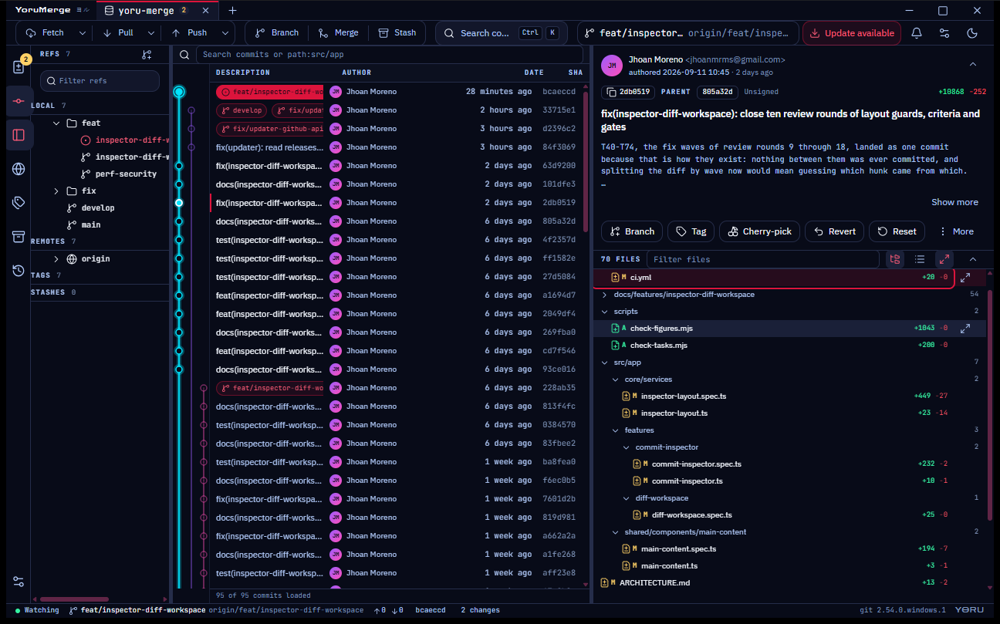
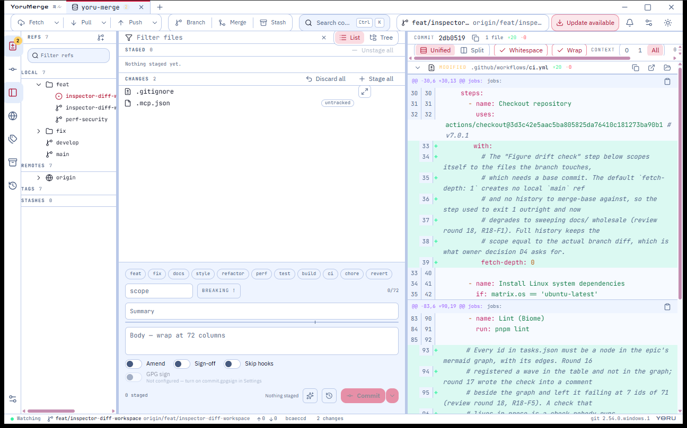
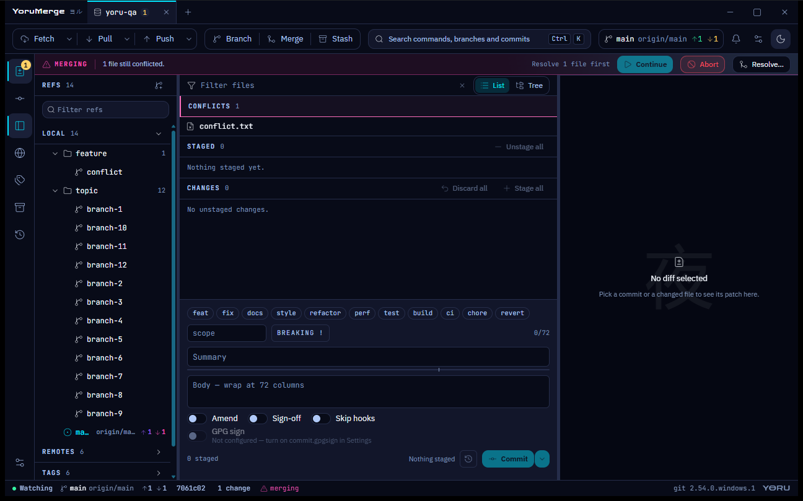

<p align="center">
  
</p>

<h1 align="center">YoruMerge</h1>

<p align="center">
  A fast, keyboard-friendly Git GUI for Windows and Linux —<br />
  Fork's daily workflow with the atmosphere of Tokyo after midnight.
</p>

<p align="center">
  <a href="https://github.com/jmoreno22/yoru-merge/actions/workflows/ci.yml"></a>
  <a href="https://github.com/jmoreno22/yoru-merge/releases/latest"></a>
  <a href="LICENSE"></a>
</p>



<details>
<summary>More screenshots</summary>





</details>

## Install

Every installer comes from the
[latest release](https://github.com/jmoreno22/yoru-merge/releases/latest).

**Requirements on every platform:** [Git](https://git-scm.com) **2.25 or
newer** available on `PATH` — YoruMerge drives your own `git`, it does not
bundle one. Authentication reuses whatever git already uses on your machine
(Git Credential Manager, an SSH agent, a credential helper); the app never
asks for or stores passwords, so if `git push` works in your terminal it works
in YoruMerge.

### Windows 10 / 11 (x64)

1. Download **`YoruMerge_<version>_x64-setup.exe`** (or the `.msi` if your
   organisation prefers MSI deployment) and run it.
2. The binaries are not code-signed yet, so SmartScreen warns on first run —
   choose **More info → Run anyway**.

Launch it from the Start menu. Uninstall from *Settings → Apps* as usual.

### Linux — one command

```bash
curl -fsSL https://jmoreno22.github.io/yoru-merge/install.sh | sh
```

It picks the right package for your distribution from the latest release and
installs it — `.deb` on Debian and Ubuntu, `.rpm` on Fedora and openSUSE, the
AppImage anywhere else. Run the same command again to update. The sections
below do the same by hand.

### Ubuntu / Debian

```bash
sudo apt install ./YoruMerge_<version>_amd64.deb
```

Dependencies (WebKitGTK 4.1) are resolved by `apt`. Launch **YoruMerge** from
your app menu or run `yoru-merge`. Uninstall with `sudo apt remove yoru-merge`.

### Fedora / openSUSE

```bash
sudo dnf install ./YoruMerge-<version>-1.x86_64.rpm
```

Uninstall with `sudo dnf remove yoru-merge`.

### Any Linux distribution — AppImage

```bash
chmod +x YoruMerge_<version>_amd64.AppImage
./YoruMerge_<version>_amd64.AppImage
```

The AppImage is self-contained; it only needs FUSE to mount itself — on
Ubuntu 22.04+ run `sudo apt install libfuse2` once. To "uninstall", delete the
file.

### macOS

Not built or tested yet.

### Updates

The app checks GitHub Releases on launch and every six hours. When a new
version exists, an **Update available** pill appears in the toolbar: it shows
the release notes and updates in place after confirmation (Windows installs
and the Linux AppImage). `.deb` / `.rpm` installs get the same notification;
update them by re-running the one-line installer above, or by installing the
new package from Releases. You can always
check manually from **Settings → About → Check for updates** or the command
palette.

### First run

- `Ctrl+O` opens a local repository; the welcome screen also clones.
- `Ctrl+K` opens the command palette — every feature is reachable from it,
  and it shows the real keyboard shortcut next to each command.
- Settings (`Ctrl+,`) cover themes, type scale, accent colours, layout,
  external editor/terminal and git identity.

Settings live in the platform app-data directory under `com.jhoan.yorumerge`
(`%APPDATA%` on Windows, `~/.config` on Linux); nothing else is written
outside the repositories you open.

## What it does

- **History** — commit list with a canvas branch graph, ref pills, author
  avatars, infinite scroll over large repositories, and a commit inspector with
  the full message, file list and per-file diff.
- **Working tree** — stage and unstage by file, hunk or line selection, discard,
  ignore, assume-unchanged, and a commit composer with conventional-commit
  chips, amend, sign-off and GPG signing.
- **AI commit messages** *(opt-in)* — drafts a message from the staged diff
  using the AI CLI you already have installed and signed in — Claude Code,
  Codex, Gemini, Qwen Code, Copilot, Cursor, Kiro, opencode, a local Ollama
  model, `llm`, or any other command that reads a prompt and prints an answer.
  It runs on **your** subscription — a provider is just a command string in
  Settings › AI, so there is no API key to enter and none is stored. Your own **house rules** ("write in Spanish",
  "never use a scope") layer on top of the built-in prompt, and *Show the
  prompt* displays exactly what would be sent. Off by default; a repository can
  refuse it outright with `git config yoru.ai false`.
- **Branches and refs** — create, rename, delete, checkout (including a dirty
  tree), set upstream, compare, plus tags, stashes and remote branches in one
  filterable panel.
- **Remotes** — fetch, pull (merge / rebase / fast-forward-only), push with
  `--force-with-lease`, streaming progress, and clear authentication errors.
- **Rewriting history** — merge, rebase, interactive rebase, cherry-pick,
  revert, reset, squash — each with continue / skip / abort when it stops.
- **Conflicts** — a three-pane resolver, take-ours / take-theirs, and a state
  banner that tells you exactly which operation is in progress.
- **Inspection** — diff viewer with syntax highlighting, split and unified
  layouts, whitespace and context controls, blame, file history, and reflog.
- **Multi-repo** — several repositories open as tabs, each with its own file
  watcher.
- **Two themes** — Yoru Night (dark) and Moonlit Workbench (light), both
  deliberate. See [DESIGN.md](DESIGN.md).

## Stack

| Layer | Technology |
| --- | --- |
| Desktop shell | Tauri 2 |
| Frontend | Angular 20, Signals, standalone components |
| Styling | Tailwind CSS 4, Lucide icons via `@ng-icons` |
| Backend | Rust, driving the `git` CLI |
| Tooling | pnpm, Biome, Vitest |

## Development

### Prerequisites

- **Node.js ≥ 22**
- **pnpm 11** — `corepack enable` picks up the version pinned in
  `package.json` (`packageManager`)
- **Rust stable** — via [rustup](https://rustup.rs)
- **Linux only** — system packages for WebKitGTK:

  ```bash
  sudo apt-get install -y libwebkit2gtk-4.1-dev libayatana-appindicator3-dev \
    librsvg2-dev patchelf libgtk-3-dev libssl-dev build-essential
  ```

### Run

```bash
cd yoru-merge
pnpm install
pnpm tauri dev
```

### Scripts

All run from the repository root:

| Command | What it does |
| --- | --- |
| `pnpm tauri dev` | run the desktop app with hot reload |
| `pnpm tauri build` | build the installers for the current platform |
| `pnpm start` | Angular dev server only, on port 1420 |
| `pnpm build` | frontend production build (enforces the bundle budgets) |
| `pnpm lint` | Biome check over `src` |
| `pnpm format` | Biome format `src` in place |
| `pnpm test` | Vitest unit tests |

Rust, from `src-tauri/`:

```bash
cargo clippy --all-targets -- -D warnings
cargo test --all-features
```

## Keyboard

`Ctrl` is `Cmd` on macOS builds. Every binding is registered in one place and
the command palette shows the real combo, so this table cannot drift silently.

| Keys | Action |
| --- | --- |
| `Ctrl+K` | command palette (`>` branches, `@` files, `#` commits, `:` settings) |
| `Ctrl+1` / `Ctrl+2` / `Ctrl+3` | Changes / History / Reflog |
| `Ctrl+B` | show or hide the refs panel |
| `Ctrl+O` | open a repository |
| `F5` | refresh the repository |
| `Ctrl+W` | close the current tab |
| `Ctrl+Tab` / `Ctrl+Shift+Tab` | next / previous tab |
| `Ctrl+Shift+F` / `Ctrl+Shift+D` / `Ctrl+Shift+U` | fetch / pull / push |
| `Ctrl+F` | search commits |
| `Ctrl+Enter` | commit |
| `Ctrl+,` | settings |
| `Ctrl+Shift+T` | switch theme |
| `n` / `p` | next / previous hunk in the diff viewer |

Lists (refs, commits, changed files) are fully keyboard-navigable with the
arrow keys, `Home`/`End`, `Enter` and `Space`.

## Troubleshooting

**Windows: paths longer than 260 characters.** Git itself fails on them, and
YoruMerge surfaces that failure rather than working around it — checkout, clone
and staging can all report a "Filename too long" error. Enable long paths on
both sides:

```powershell
git config --global core.longpaths true
# and, once, as an administrator:
Set-ItemProperty -Path 'HKLM:\SYSTEM\CurrentControlSet\Control\FileSystem' `
  -Name LongPathsEnabled -Value 1
```

The registry change needs a sign-out (or reboot) to take effect.

**Reporting a bug.** *Settings → About → Copy diagnostics* puts the app
version, git version and platform on your clipboard — paste that into a
[GitHub issue](https://github.com/jmoreno22/yoru-merge/issues) together with
what you did and what you expected.

## Documentation

| File | Contents |
| --- | --- |
| [ARCHITECTURE.md](ARCHITECTURE.md) | the three layers and how they talk |
| [DESIGN.md](DESIGN.md) | the design system — read before touching UI |
| [CONTRIBUTING.md](CONTRIBUTING.md) | conventions and the pre-PR checklist |
| `src/app/shared/ui/README.md` | the UI kit API |
| `src/app/shared/icons/README.md` | Git concept → icon map |

## License

MIT © 2026 jhoan
