# Software Architecture Document — inspector-diff-workspace

## 1. Introduction and goals

> **Glossary:** [feature CONTEXT](./CONTEXT.md) · [project CONTEXT](../../../CONTEXT.md)
> **Upstream:** [spec.md](./spec.md) (§2 goals, §5 AC, §6 NFR) · [ux-flows.md](./ux-flows.md) (platform decisions, SCR-01…06) · brownfield scan of 2026-09-02 (no `docs/architecture-map.md` exists yet — run `/sdd:survey` to persist one).

**Intent.** Make the diff viewer the dominant surface of the inspector whenever a commit is selected, and let the developer hand any single file's diff the full centre width and come back in one gesture each way, from both the History and the Changes view. The commit header and the commit file list shrink to orientation aids that yield height before the diff does; the diff workspace is a state of the centre view (not a route, window, tab or overlay) that restores the exact previous selection, scroll and focus on close. Every existing layout mode keeps working unchanged, so the redesign is additive for existing habits.

**Top-3 quality goals (1-liners; full scenarios in §10):**

1. **Diff dominance in the inspector** — the diff viewer receives ≥ 50 % of the inspector height with the header expanded and ≥ 75 % collapsed (inspector right, no stacked panels), and never less than the 1.0.5 height at the bottom or with stacked panels.
2. **Round-trip fidelity of the diff workspace** — open in ≤ 150 ms without loading the diff a second time, close in ≤ 100 ms with the identical selection, scroll offset and focus, and Esc closes only the topmost of the six layers (0 mis-fires).
3. **Additive to existing habits** — 0 layout regressions across themes × densities × placements, 0 px layout shift when the remembered header / file-list state first paints, and 100 % of diff workspace actions reachable by keyboard.

**Stakeholders.**

| Role | Interest | Sign-off owner? |
|---|---|---|
| developer | Reviews commits in History and their own changes in Changes; reads diffs at inspector or full centre width; keeps current habits (placement, density, theme, stacked panels) | No |
| Owner (Jhoan Moreno) | Daily user who surfaced the friction; decides §10 quality-goal priorities and §11 risk severities | Yes (spec owner) |
| Tech Lead | SAD approval; keyboard-layer precedence owner (ux-flows flagged it as unassigned) | Yes |

## 2. Constraints

**Technical.**
- Angular 22.1.4 + TypeScript 6.0.3 (strict), standalone components, signals, `ChangeDetectionStrategy.OnPush`, zoneless. **No Angular Router**: the centre view is a `@switch` over the `railView` preference in `src/app/shared/components/main-content/main-content.html`; the inspector column is a flex stack (commit inspector `flex-[2]`, diff viewer `flex-[3]`, blame `flex-[3]`, file history `flex-[2]`).
- Tauri 2 desktop shell (Rust 2021). Frontend ↔ backend only through the typed `invoke` wrapper `TauriGitService` (`src/app/core/services/tauri-git.service.ts`); diffs come from the `get_commit_file_diff` / `get_diff` commands, staging from `stage_hunks` / `unstage_hunks` / `apply_patch`. The repository watcher pushes `repo-changed` Tauri events, debounced 400 ms in `CurrentRepoService`.
- Tailwind CSS 4.3.3. Every fixed dimension comes from the density tokens `AppearanceService` writes on `<html>` (`--row-h`, `--file-row-h`, `--panel-head-h`, `--panel-pad`, …); `--file-row-h` is pinned to the CDK virtual-scroll `FILE_ROW_HEIGHT` and must not be overridden in CSS. Z-index only from the four `--z-*` tokens (`DESIGN.md` §Z-layers).
- Durable UI preferences live in `PreferencesService` (`DurablePreferences`, `src/app/core/services/preferences.service.ts`), persisted to the Tauri plugin-store `preferences.json` with a 500 ms debounce; appearance keys are mirrored to localStorage for the pre-boot paint. No database, no network.
- Minimum window 960 × 640; both densities (comfortable / compact), both placements (inspector right / bottom), both themes.
- Toolchain: Node ≥ 22.22.3 + pnpm; Vitest 4.1.11; Biome; `cargo clippy -D warnings` + `cargo fmt --check`.

**Organisational.**
- Size M, route standard (`.size` / `.route`): 5–15 PRs, 1–2 sprints as the size-matrix reference. No deadline; the 1.0.5 release closed the toolchain work and no roadmap item touches the workbench layout.
- Single maintainer: the Owner is architect, implementer and daily user; Tech Lead review on the SAD.

**Conventions.**
- `AGENTS.md` (strict TS, `strictTemplates`, test policy), `DESIGN.md` §Layout / §Density / §Z-layers / §App shell / §Accessibility, `CLAUDE.md`.
- A feature is a standalone component folder under `src/app/features/<name>/` (`.ts` + `.html`); domain state and IPC in `src/app/core/services/` (+ `ops/`); UI primitives `Yoru*` under `src/app/shared/ui/`; shell pieces under `src/app/shared/components/`.
- Shortcuts are registered through `KeyboardShortcutsService.register({ id, combo, label, when, run })` (`src/app/shared/ui/keyboard-shortcuts.service.ts`); the command palette and the Keyboard settings page render that list, so «the shortcuts help» of AC-12 is satisfied by registration alone. Esc is today handled outside that service by four ad-hoc `(document:keydown.escape)` handlers (blame viewer, command palette, commit search, diff line selection) — first listener wins.
- **Frontend unit tests are pure TypeScript** (no `@angular/core` imports, node environment — `AGENTS.md`). Consequence: any logic this feature wants unit-tested (restore snapshot, Esc layer order, file-navigation order, height floors) must live in framework-free modules; component contracts are checked by `pnpm build` with `strictTemplates`. There is no Playwright / Storybook tier.
- Durable preferences are declared in `src/app/core/services/preferences-schema.ts` and covered by its spec test.

**Regulatory / external.**
- spec §6.1: internal data already on the developer's machine, no new personal data, no authN/Z (single-user desktop app), security review N/A.
- Business rule, not authorization: staging is offered solely for working-tree diffs (AC-14).
- Inherited abuse-case controls: composer shortcuts inert while the diff workspace is open (AC-15); refresh on watcher events before any stage action (AC-16); file names and commit subjects rendered as text; Reset keeps its confirmation (AC-21).
- Accessibility per `DESIGN.md` §Accessibility: WCAG AA contrast, the single global `:focus-visible` rule, `prefers-reduced-motion`, no new blur-dependent surface.

## 3. Context and scope

YoruMerge is a single-user desktop Git client: the developer operates it on their own machine to read and change a local repository. This feature rearranges the inspector (collapsible commit header, compact commit file list, diff-dominant layout) and adds one centre-view state, the diff workspace, in the History, Reflog and Changes views. Nothing leaves the machine: the only systems outside the app are the local Git repository on disk, the OS file-system notifications that feed the repository watcher, and the preferences file the app already owns. **External third-party systems: none (deliberate — the feature rearranges existing read and stage surfaces).**

<!-- brownfield: Angular 22 + Tauri 2 desktop app; signals-only state (WorkspaceStore → per-tab RepoState, PreferencesService → preferences.json); no router — the centre view is a @switch over railView; KeyboardShortcutsService flat first-match list plus four ad-hoc Esc handlers; diffs via Tauri commands into repo.diffText; watcher emits repo-changed. Scan of 2026-09-02 by the explorer agent; no docs/architecture-map.md exists — run /sdd:survey to persist one. -->

**External systems (in / out):**

| Actor or system | Type | Interaction |
|---|---|---|
| developer | Person | Selects commits and files; collapses / expands the commit header and the commit file list; opens the diff workspace (double-click, control, shortcut), steps through files, closes it (Esc / Close); stages or unstages hunks and lines from a working-tree diff; reads the shortcuts list |
| Local Git repository (working tree + `.git`) | System (external, on disk) | In: commit details, commit file diffs, working-tree diffs (staged / unstaged). Out: stage / unstage of hunks and lines. History rewritten or fetched outside the app may remove the commit a diff workspace shows (AC-07) |
| OS file-system notifications | System (external) | In: change events on the repository path, surfaced to the UI as `repo-changed` Tauri events after a 400 ms debounce; drive the refresh / auto-close rules of AC-16 and AC-17 |
| `preferences.json` (Tauri plugin-store) | Datastore (internal, on disk) | Read on boot, written debounced 500 ms. Gains the remembered collapsed states of the commit header and the commit file list (AC-02, AC-05); already holds the diff viewer's layout / whitespace / wrap / context preferences the diff workspace shares (AC-06) |

**Trust boundary.** Everything inside the Tauri window is trusted UI state; repository content (file names, commit subjects, diff text) crosses the boundary from the Git repository and is rendered as text, never interpreted (spec §6.1 abuse case). The diff workspace introduces no new boundary.

**C4 Context (L1):**

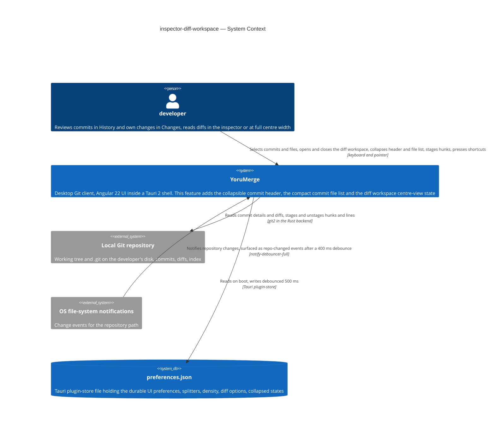

## 4. Solution strategy

**Target surface(s): `[desktop-app]`** (frontmatter `target_surfaces`). The feature is UI-only inside the existing Angular-in-Tauri desktop application; it introduces no Tauri command and no change on the Rust side (it reuses `get_commit_file_diff`, `get_diff`, `stage_hunks` / `unstage_hunks` / `apply_patch`). The UI architecture is fixed by the repo (cross-platform web UI in the Tauri webview, signals, no router — §2), so the per-surface UI-architecture decision for this feature is the runtime model of the diff workspace (pillar 1, ADR-0001). `ux-flows.md` (SCR-01…SCR-06) is the evidence: every §4 user story of the spec has a screen. A single surface does not cross the blast-radius gate (no legitimate alternative), so it stays inline.

**Top strategic choices (the seeds for ADRs):**

1. **Model the diff workspace as in-memory centre-view state with a restore snapshot, not a persisted view** (ADR-0001). A single `DiffWorkspaceState` — closed, or open with `{ source: commit sha | working-tree side, file, snapshot }` — lives in `core/`, framework-free and unit-tested; `main-content` consults it *before* the `railView` `@switch`, so the workspace replaces the centre content in place and `railView` never changes. On open it captures the selected commit (or side), the active file, the commit-list scroll offset (`repo.listScrollTop` already exists) and a focus key for the originating row; on close it replays them (AC-08; NFR «close ≤ 100 ms» verified by a pure-TS test). It is never persisted (AC-17: coming back to a view shows its list), and any change of selection, rail view or repository tab closes it (feature CONTEXT invariant). Rejected: a new `railView` value (persisted, would survive restarts and tab switches) and a keep-alive hidden centre (`display:none` loses scroll position; focus needs a snapshot anyway).

2. **Route Esc through one rank-ordered layer registry** (ADR-0002). A framework-free `escape-layers.ts` in `core/` keeps the open layers with fixed ranks — dialog 6 › command palette 5 › text field with content 4 › diff line selection 3 › stacked blame / file history 2 › diff workspace 1 — and a single document `keydown` handler closes only the topmost open one (AC-10; NFR 0 mis-fires over the six-layer matrix, verified by a pure-TS test of the order). The six consumers register on open / unregister on close instead of each owning a `(document:keydown.escape)` listener; the «text field with content» layer is a built-in rule (focused editable with a non-empty value clears it and keeps focus), so the commit filter and future inputs need no registration. Rejected: a `priority` field on `KeyboardShortcutsService` (Esc entries would appear in the palette and the Keyboard settings page, mixing commands with layer dismissal) and keeping the ad-hoc handlers ordered by `defaultPrevented` (mount order is not stable — first-listener-wins is the current bug).

3. **One diff viewer instance, re-hosted into the centre when the workspace opens** (ADR-0003). The existing `DiffViewer` (options bar + `DiffView`) stays the only renderer of a diff. Its live host element moves from the inspector slot into the workspace slot with a CDK `DomPortal` (moves the DOM, no destroy / recreate) and back on close, so opening never re-fetches (`repo.diffText` untouched) nor re-renders a 2 000-line non-virtualised diff (NFR first paint ≤ 150 ms), and the layout / whitespace / wrap / context controls are literally the same widgets bound to the same preferences (AC-06). The inspector's diff slot collapses while the element is away (AC-06 «hidden, its height goes to the header and the file list»); hunk / line staging keeps working because the diff source is unchanged; the workspace itself is a thin header (file path, source, previous / next, Close) around the portal outlet. Rejected: a second `<app-diff-viewer>` in the centre (full re-render of an unvirtualised diff on every open, duplicated line-selection state).

4. **Size the inspector blocks with an explicit, testable layout policy** (ADR-0004). The inspector column stops being `flex-[2] / flex-[3]`: the commit header is content-sized (body clamped to 4 lines, floor 1), the commit file list is bounded (6 rows max, 2 min, exact row count when fewer, header-only when collapsed) and the diff viewer takes the remainder with a floor of 50 % of the inspector. Because AC-03 requires a *sequential* yield (the list shrinks first, then the body clamp), the visible rows and clamp lines come from a pure-TS `inspector-layout.ts` function of (available height, file count, density tokens, collapsed states) fed by a `ResizeObserver` and applied as CSS variables — not from flex-shrink weights, which shrink proportionally and cannot be unit-tested. Stacked blame / file history keep their current share (AC-19); the bottom placement runs the same policy (AC-18). Rejected: a CSS-only flex / `min-height` / `line-clamp` arrangement (cannot express the sequential order; floors untestable without a browser tier).

5. **Remembered states are ordinary durable preferences** (inline — repo convention, no alternative). `commitHeaderCollapsed` and `commitFileListCollapsed` join `DurablePreferences` in `preferences-schema.ts` (plugin-store `preferences.json`, debounced 500 ms) next to the existing diff options. The inspector reads them synchronously at render; since it only renders after a repository is open and a commit is selected, the store has resolved long before its first paint (NFR 0 px layout shift), so no localStorage mirror is needed.

Each tactical decision in later sections should trace to one of these seeds. Tactical decisions that *contradict* a strategic choice are red flags — surface them in §11.

## 5. Building block view

The feature follows the repo's layering as it is: **standalone Angular components → the `CurrentRepoService` façade over per-tab `RepoState` signals → domain ops → `TauriGitService` (typed `invoke`) → Rust commands**. Nothing new on the Rust side. What the feature adds is (a) one new feature component folder, `features/diff-workspace/`, (b) three framework-free logic modules in `core/services/` with Vitest specs — the workspace state machine, the inspector layout policy and the Esc layer registry — each wrapped by a thin Angular service, and (c) surgical changes in the components the workspace replaces or re-hosts. Framework-free modules next to their Angular service is already the repo's pattern (`appearance-metrics.ts`, `preferences-schema.ts`, `view-transition.ts` each carry a `.spec.ts`), so the §2 test constraint is met without a new folder convention. The single declared surface (`desktop-app`) is the Angular UI container; the Rust core is drawn as the internal container it already is.

**Ownership rules that §6 relies on:**

- **Who opens the workspace.** The list that owns the gesture — `CommitInspector` for a commit's files, `WorkingChanges` for a staged or unstaged side — calls `DiffWorkspaceService.open({ source, files, index, snapshot })`, passing the file paths **in the order it currently displays them** (tree or flat, folders skipped; one side only in Changes). The list re-publishes the ordered paths when its order or its content changes while the workspace is open, so previous / next always follow the visible order (AC-11, AC-13) without the workspace knowing about trees or sides.
- **Who shows the diff.** Only `DiffViewer`. The workspace component hosts its live element through a `CdkPortalOutlet` (ADR-0003); the inspector's diff slot is the element's home and collapses while it is away. Staging controls stay gated by `diffSource` (commit → none; working tree → hunk / line stage and unstage), so AC-14 needs no new rule.
- **Who closes the workspace.** `DiffWorkspaceService` itself, from three triggers: the Close control or the rank-1 Esc layer; an `effect` on the selection signals (`selectedCommitSha`, the working-tree side, `railView`, `activeTabId`) that differ from the snapshot (AC-17); and the list owner reporting that the shown file left the shown side (AC-13 advance-or-close, AC-16 close with notice). Restore replays the snapshot: `repo.listScrollTop`, the selection, and focus on the row identified by the focus key (or the now-active file row).
- **Who sizes the inspector.** `CommitInspector` observes its own height and asks `inspector-layout.ts` for the visible list rows and body clamp lines (ADR-0004); the released height flows to the diff slot because the diff slot is the only `flex-1` child.

**Internal decomposition:**

```
src/app/
├── core/services/
│   ├── diff-workspace-state.ts          pure TS: closed | open { source, file, files, index, snapshot }
│   │                                    open / navigate / setFiles / close → restore instructions (+ .spec.ts)
│   ├── diff-workspace.service.ts        Angular: signals over the state; applies restore (listScrollTop, focus key);
│   │                                    effect closes on selection / view / tab change
│   ├── inspector-layout.ts              pure TS: (available px, fileCount, density tokens, collapsed states)
│   │                                    → { listRows, clampLines } with the AC-03 floors (+ .spec.ts)
│   ├── escape-layers.ts                 pure TS: ranked registry, topmost-open resolution, text-field rule (+ .spec.ts)
│   ├── escape-layers.service.ts         Angular: the single document keydown for Esc; register / unregister API
│   └── preferences-schema.ts            + commitHeaderCollapsed, commitFileListCollapsed (durable, preferences.json)
├── features/
│   ├── diff-workspace/                  NEW · diff-workspace.ts / .html: header (path, source, previous / next, Close)
│   │                                    + CdkPortalOutlet; registers the rank-1 Esc layer and the open / close /
│   │                                    previous / next shortcuts through KeyboardShortcutsService
│   ├── commit-inspector/                collapsible header (summary line, inline actions overflowing into More),
│   │                                    compact file list, ResizeObserver → inspector-layout, open-large gesture
│   ├── working-changes/                 open-large gesture on staged / unstaged rows; hidden while the workspace is open;
│   │                                    commit / commit-draft shortcuts guarded by `when: () => !workspace.open()`
│   ├── diff-viewer/                     DomPortal source; line-selection registers the rank-3 layer instead of its own Esc
│   ├── commit-list/                     focus key per row; commit-search relies on the built-in text-field rule
│   ├── blame/, file-history/            register the rank-2 layer instead of `(document:keydown.escape)`
│   ├── command-palette/                 rank 5
│   └── dialogs/ + shared/ui/yoru-dialog rank 6
└── shared/components/main-content/      centre: `@if (workspace.open())` before `@switch (view())`;
                                         inspector column: diff slot = portal source, flex-1
src-tauri/                               unchanged (get_commit_file_diff, get_diff, stage_hunks, unstage_hunks,
                                         apply_patch, repo-changed watcher)
```

**C4 Container (L2):**

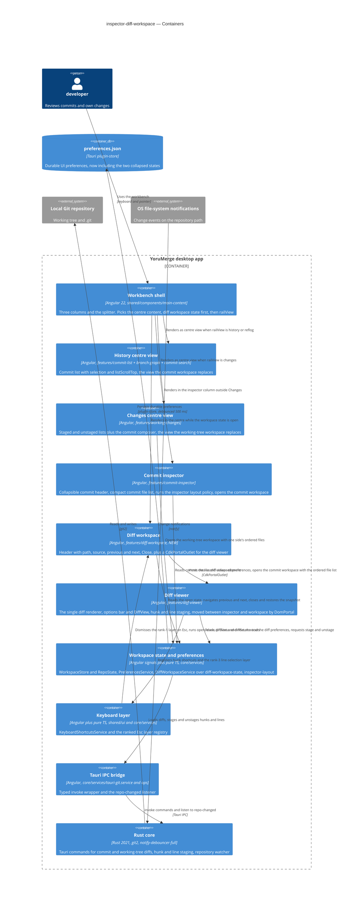

## 6. Runtime view

Two flows are seeded here; the `sequences` stage covers every §5 AC (in particular AC-17 close-on-selection-change, AC-07 commit removed by a refresh, AC-21 collapsed-header actions). Participants are the §5 containers.

**Critical flow 1: open a commit file in the diff workspace, step to the next file, close with Esc and restore** (US-03, US-04, US-05 — AC-06, AC-08, AC-10, AC-11)

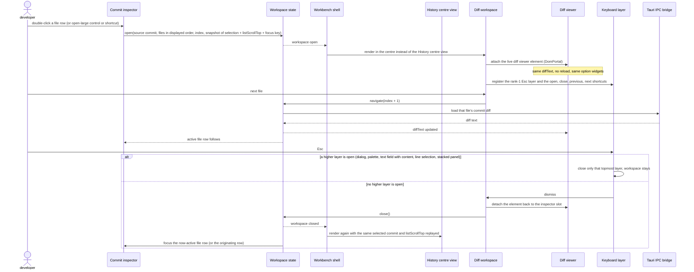

**Critical flow 2: stage a hunk from the working-tree workspace, watcher refresh, side left empty** (US-06 — AC-13, AC-15, AC-16; the external-event path)

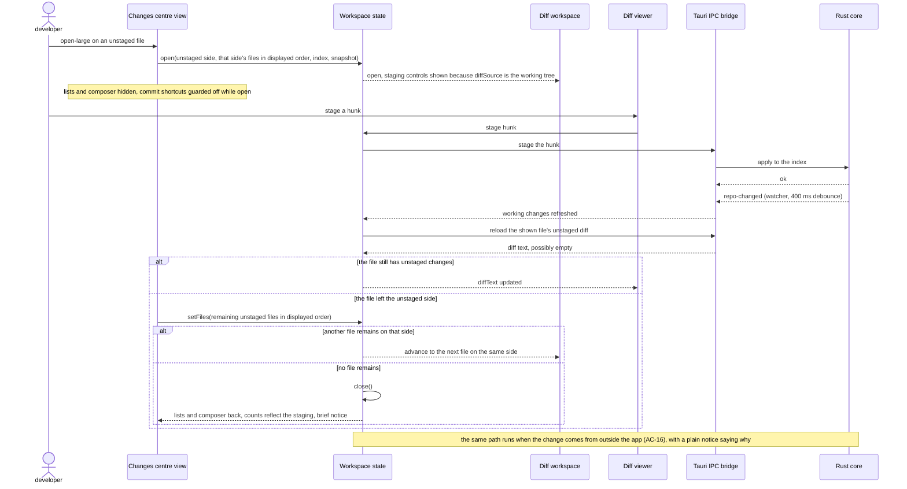

### Flow F1 — Select a commit: header, file list and height policy

(US-01, US-02 — AC-01, AC-03, AC-04; first-paint half of AC-02 and AC-05.) Generic participants per the `sequences` vocabulary: `user`, `ui`, `service`, `data-store` (the preferences file), `external-system` (the local Git repository).

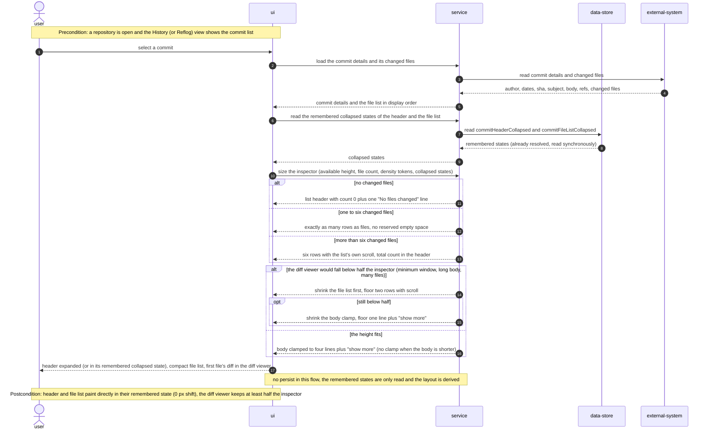

The developer selects a commit. The UI asks the service for the commit details and its changed files, which the service reads from the repository; the service also reads the two remembered collapsed states from the preferences store synchronously, so the first paint is already correct. The service then runs the height policy on the available inspector height, the file count, the density tokens and the collapsed states. The file list branch sizes the list (no files: header with count 0 and one line; one to six files: exact rows; more: six rows with scroll and the count). The height branch handles the squeezed case (list shrinks first to a floor of two rows, then the body clamp to a floor of one line) and otherwise clamps the body to four lines. Nothing is persisted here.

### Flow F2 — Collapse or expand the commit header and the commit file list, remember the state

(US-01, US-02, US-07 — AC-02, AC-05, AC-18, AC-19.)

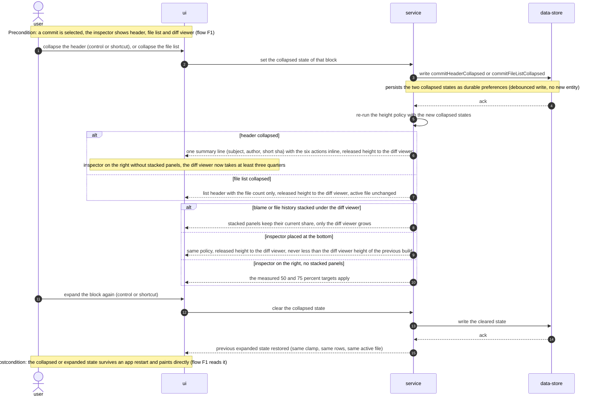

The developer collapses the header (control or shortcut) or the file list. The UI hands the new collapsed state to the service, which writes it to the preferences store (a debounced durable preference, no new entity) and re-runs the height policy. Header collapsed: one summary line with the six actions inline, released height to the diff viewer (three quarters on the right without stacked panels). File list collapsed: header with the count only, height to the diff viewer, active file unchanged. The placement branch then says where the released height goes: with blame or file history stacked they keep their share and only the diff viewer grows; at the bottom the same policy runs and the diff viewer never drops below its 1.0.5 height; on the right without stacked panels the measured targets apply. Expanding again clears the state, writes it, and restores the previous expanded layout. The state survives a restart because F1 reads it at first paint.

### Flow F4 — Open a diff that cannot be shown, or lose the commit's file list while the diff workspace is open

(US-03 — AC-07. The happy path of the open gesture, AC-06, is critical flow 1 above.)

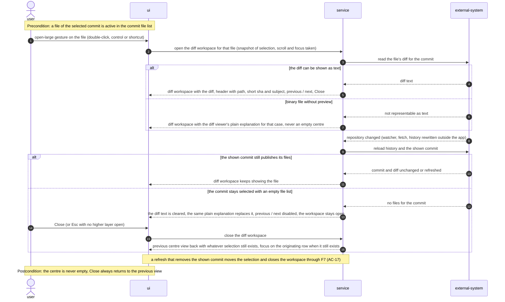

The developer opens the active file with the open-large gesture; the service takes the restore snapshot and reads the file's diff for the commit. If the diff is text, the workspace shows it with its header (path, short sha and subject, previous / next, Close). If the file is binary without preview, the workspace shows the diff viewer's plain explanation instead of an empty centre. Later the repository changes from outside (watcher, fetch, history rewritten) and the service reloads history and the shown commit: if the commit still publishes its files the workspace keeps showing the file; if the commit stays selected but its file list comes back empty, the diff text is cleared so the same plain explanation replaces it, previous / next are disabled, the workspace stays open, and Close (or Esc with no higher layer) returns to the previous view with whatever selection still exists and focus on the originating row when it is still there. A refresh that removes the shown commit is a selection change, not this flow: it closes the workspace through F7 (AC-17).

### Flow F7 — A selection change closes the diff workspace

(US-03 — AC-17.)

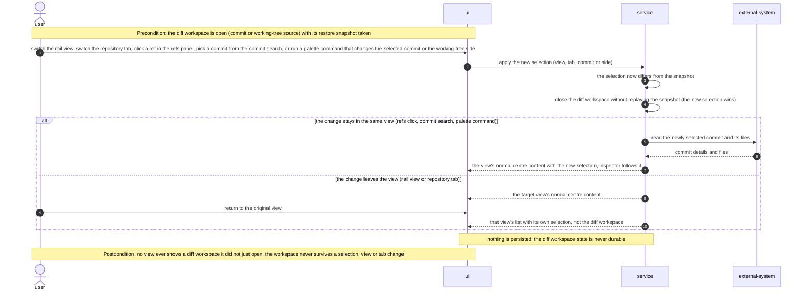

With the workspace open, the developer switches the rail view or the repository tab, clicks a ref, picks a commit from the commit search, or runs a palette command that changes the selected commit or the working-tree side. The service applies the new selection, notices it differs from the snapshot and closes the workspace without replaying the snapshot: the new selection wins. If the change stays in the same view, the service loads the newly selected commit and the view shows its normal centre content with that selection. If the change leaves the view, the target view shows its normal content, and returning to the original view shows its list with its own selection, never the workspace. The workspace state is never persisted.

### Cross-cutting: Escape closes only the topmost layer

(US-04 — AC-10. Cross-cutting: the same resolution runs whether or not the diff workspace is open.)

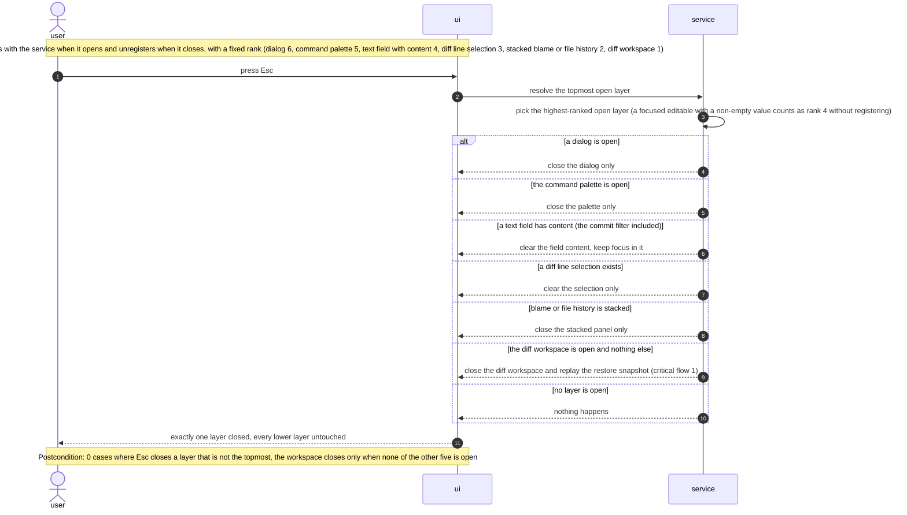

Every dismissable layer registers with the service on open and unregisters on close, carrying a fixed rank. On Esc the UI asks the service for the topmost open layer (a focused editable with content counts as the text-field rank without registering). The branches follow the rank order: an open dialog closes; else the command palette; else the text field's content clears and keeps focus; else the diff line selection clears; else the stacked blame or file-history panel closes; else, with nothing else open, the diff workspace closes and replays its restore snapshot; with no layer open nothing happens. Exactly one layer closes per press and every lower one stays.

### Flow F5 — Step through files and press shortcuts inside the diff workspace

(US-05, US-04, US-06 — AC-09, AC-11, AC-12, AC-14, AC-15.)

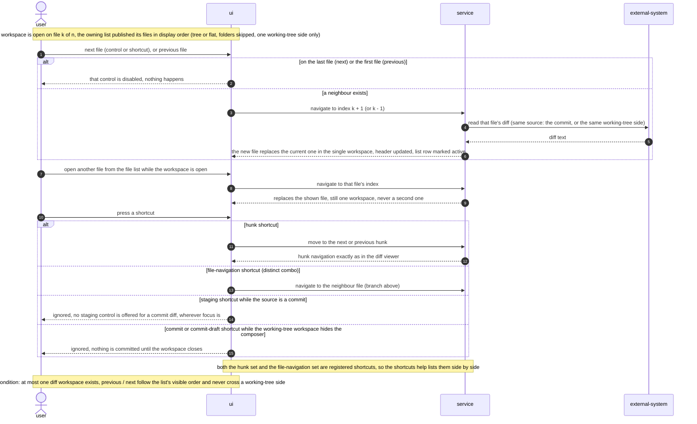

Inside the workspace on file k of n, next or previous file first checks the edge: on the last (or first) file the control is disabled and nothing happens; otherwise the service loads the neighbour's diff from the same source, the new file replaces the current one, the header updates and the list marks that row active. Opening another file from the list while the workspace is open also replaces the shown file: there is never a second workspace. Pressing a shortcut branches four ways: the hunk shortcuts move between hunks exactly as in the diff viewer; the distinct file-navigation shortcuts navigate as above; a staging shortcut is ignored when the source is a commit, wherever focus is; the commit and commit-draft shortcuts are ignored while the working-tree workspace hides the composer. Both shortcut sets are registered, so the shortcuts help lists them side by side.

### Flow F8 — External change while a working-tree file is shown in the diff workspace

(US-06 — AC-16. Event-driven: the trigger is an OS file-system notification, not a user gesture. There is no message bus, so the async shape is idempotent reload, no retry, no dead-letter, see the note at the end of §6.)

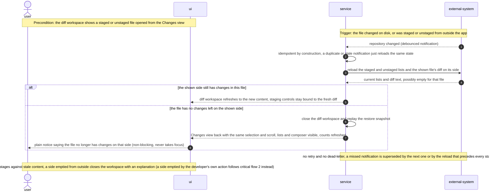

While a working-tree file is shown, the file-system notifies that the repository changed (the file edited on disk, or staged or unstaged from outside). The service treats the notification as idempotent (a duplicate simply reloads the same state), reloads the staged and unstaged lists and the shown file's diff on its side. If the side still has changes in this file, the workspace refreshes and its staging controls bind to the fresh diff. If the file has no changes left on that side, the service closes the workspace, replays the restore snapshot so the Changes view returns with the same selection, scroll and refreshed counts, and the UI shows a non-blocking notice saying why. No retry and no dead-letter exist: a missed notification is superseded by the next one or by the reload before every stage action. A side emptied by the developer's own action is critical flow 2, not this one.

### Flow F3 — Run a commit action from the collapsed header

(US-08 — AC-21.)

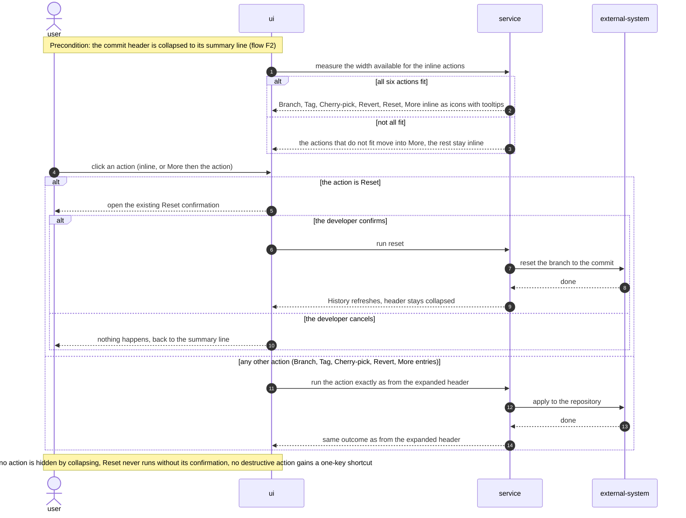

With the header collapsed, the UI measures the width left for the inline actions: when all six fit they sit inline as icons with tooltips, otherwise the ones that do not fit move into More. The developer clicks an action, inline or through More. Reset first opens the existing confirmation; confirm runs the reset against the repository and refreshes History with the header still collapsed, cancel returns to the summary line. Every other action runs exactly as it does from the expanded header. No commit action gains a one-key shortcut here.

### Coverage — user stories and acceptance criteria → flows

Written by `sequences` (2026-09-03). «Critical flow 1 / 2» are the two flows seeded by `design` above; F1–F8 and the cross-cutting Esc flow were added here. Every §4 user story maps to at least one flow and every §5 AC to a flow, an `alt` / `else` branch or an explicit non-runtime N/A.

| User story | Realised by |
|---|---|
| US-01 | F1, F2 |
| US-02 | F1, F2 |
| US-03 | Critical flow 1, F4, F7 |
| US-04 | Critical flow 1, Cross-cutting Esc, F5 (single-workspace invariant) |
| US-05 | Critical flow 1, F5 |
| US-06 | Critical flow 2, F5 (inert shortcuts), F8 |
| US-07 | F2 (placement branches: stacked panels, bottom); AC-20 is non-runtime |
| US-08 | F3 |

| AC | Shown by | Where |
|---|---|---|
| AC-01 | F1 | happy path, «the height fits» branch |
| AC-02 | F2 + F1 | collapse / expand branch with the persist note; F1 reads the remembered state at first paint |
| AC-03 | F1 | «would fall below half» branch: list floors at two rows, then clamp floors at one line |
| AC-04 | F1 | file-count branch: 0 / 1–6 / more than 6 |
| AC-05 | F2 + F1 | «file list collapsed» branch with the persist note; F1 reads it at first paint |
| AC-06 | Critical flow 1 | open gesture, live viewer re-hosted without reload, same option widgets |
| AC-07 | F4 | «binary without preview» and «sha stays, list empties» branches, Close still returns; a removed commit moves the selection and follows F7 / AC-17 |
| AC-08 | Critical flow 1 | «no higher layer» branch: same commit and scroll replayed, focus on the row |
| AC-09 | F5 | «open another file while open» step and the neighbour branch: one workspace |
| AC-10 | Cross-cutting Esc (+ Critical flow 1 summary `alt`) | one branch per ranked layer |
| AC-11 | F5 | edge branch (disabled at the ends) and neighbour branch (list's visible order) |
| AC-12 | F5 | shortcut branch: hunk set vs. distinct file set, both registered |
| AC-13 | Critical flow 2 | stage a hunk, advance on the same side or close with a notice |
| AC-14 | F5 | shortcut branch: staging shortcut ignored when the source is a commit |
| AC-15 | F5 (+ Critical flow 2 note) | shortcut branch: commit / commit-draft ignored while the composer is hidden |
| AC-16 | F8 | external notification: refresh, or close with a plain notice |
| AC-17 | F7 | same-view and leave-view branches, never persisted |
| AC-18 | F2 | placement branch «inspector placed at the bottom» |
| AC-19 | F2 | placement branch «blame or file history stacked» |
| AC-20 | non-runtime N/A | density tokens and the app contrast rule are CSS, verified by the release checklist (§7, §10 QG-3); no runtime step exists to draw |
| AC-21 | F3 | fit / overflow branch and Reset confirmation branch |

### Notes for `design` / `data-model` (flags, not decisions)

- **Participant vocabulary.** F1–F8 use the generic `sequences` vocabulary (`user`, `ui`, `service`, `data-store` = the preferences store, `external-system` = the local Git repository and the OS file-system notifications). The two critical flows seeded by `design` keep the §5 container names; they were left untouched (additive rule). Angle brackets were dropped from the generic names because Mermaid strips them as HTML.
- **Persist notes for `data-model`.** Only F2 writes: `commitHeaderCollapsed` and `commitFileListCollapsed` as durable preferences (§4 pillar 5). No new entity, column or index in any flow; the diff workspace state (F4, F5, F7, F8) is never persisted. `data-model`'s no-schema-change condition holds.
- **Async shape of F8.** The skill's async pattern asks for an idempotency key, a retry note and a dead-letter branch. F8 is event-driven but has no message bus: the reload is idempotent by construction, and a missed notification is superseded by the next one or by the reload before every stage action, so no retry and no dead-letter were drawn. Worth one line in ADR-0001 or §8 «Events» if `design` wants it explicit.
- **No new participant** beyond §5. The Cross-cutting Esc flow relies on the ranked registry of ADR-0002; the «text field with content» rank is the built-in rule from that ADR, drawn as a self-call.

## 7. Deployment view

YoruMerge ships as one Tauri 2 desktop bundle per OS (`bundle.targets: "all"` in `src-tauri/tauri.conf.json` → Windows NSIS / MSI, Linux deb / AppImage, macOS dmg), built by GitHub Actions `release.yml` on native runners and distributed through the updater plugin (`createUpdaterArtifacts: true`) and winget (`winget.yml`). This feature ships inside the frontend bundle of the next release: no new Tauri command, plugin, capability or permission, no new npm dependency (`@angular/cdk` is already present), no infra change. One process per window; no replicas, no horizontal scaling.

**Monitoring:**
- Runtime telemetry: none — nothing leaves the machine (spec §6.1).
- Build-time gates: `pnpm build` with `strictTemplates` (component contracts); Vitest specs for `diff-workspace-state`, `inspector-layout` and `escape-layers`; Biome; `cargo clippy` / `cargo fmt` unchanged (no Rust change).
- Release-time measurements (spec §6): diff-viewer height share at 960 × 640 and 1280 × 800 in both densities; performance-panel timing of the workspace open on a 2 000-line diff; the six-layer Esc keyboard matrix; layout-shift on launch in both remembered states; the release checklist over both themes × both densities × both placements.
- Alerts / tracing: none.

**Scaling thresholds:**
- Not applicable to a desktop app. The two axes that grow are the commit file count — bounded to 6 visible rows with own scroll, so a 30- or 3 000-file commit costs the same inspector height — and the diff size, budgeted at the spec's 2 000-line measurement; `DiffView` is unvirtualised and the workspace neither improves nor worsens that (ADR-0003) — see §11.

## 8. Crosscutting concepts

Default = the repo's conventions; the only feature-specific choice is the Notices row.

| Concept | Convention | Where defined |
|---|---|---|
| Logging | None in the frontend (0 `console.*` in `src/app`); user-facing outcomes go through `ToastService` | repo convention |
| Authentication / authorization | N/A — single-user desktop app. The only permission-like rule is business: staging only for working-tree diffs, gated by `diffSource` | spec §6.1, AC-14 |
| Error handling | Mutating actions run through `OpsRunner.run` (busy flags, error signal, failure toast «<Context> failed: …»); a stage on stale content fails with today's message and nothing is half-applied. Diff-load failures (binary without preview, commit removed by a refresh) render the diff viewer's existing plain explanation inside the workspace | `core/services/ops/ops-runner.ts`, `DiffViewer`, AC-07 |
| Notices | The two non-blocking notices (AC-13 side emptied by own action, AC-16 by an external change) are `ToastService.info` in the existing toast host (`--z-toast`); they never take focus | `ToastService`, ux-flows §Platform decisions |
| State and persistence | Signals only. Per-tab runtime state in `RepoState`; app-wide runtime state in services (`DiffWorkspaceService`, never persisted); durable preferences only through `DurablePreferences` → `preferences.json` | §4 pillars 1 and 5 |
| Keyboard | Commands via `KeyboardShortcutsService.register` (auto-listed in the command palette and the Keyboard settings page); Esc dismissal via the ranked `escape-layers` registry. The new combos (open-large, previous file, next file, collapse header / list) must not collide with `n` / `p` (hunks) or existing `mod+…` bindings; the concrete keys are a screen-level choice made in `screens`, not here | ADR-0002, `shared/ui/keyboard-shortcuts.service.ts` |
| Focus management | Direct `element.focus()` on a row found by a stable key attribute, as commit-search does today; the global `:focus-visible` ring is never overridden | `DESIGN.md` §Accessibility, commit-list precedent |
| Layout tokens and density | Sizes only from `--file-row-h`, `--panel-head-h`, `--panel-pad`; the body clamp is `-webkit-line-clamp` driven by a CSS variable the layout policy sets; the workspace is in-flow, no z-index | `DESIGN.md` §Density / §Z-layers, ADR-0004 |
| Motion | Opening / closing the workspace is a plain swap (no View Transition); respects `prefers-reduced-motion` and `data-animations="off"` | `DESIGN.md` §Accessibility |
| Internationalisation | N/A — English-only UI (no `$localize` in the repo) | — |
| Observability | None at runtime; verification by build, specs and the release checklist | §7 |
| Events | Only the existing `repo-changed` Tauri event, consumed by `CurrentRepoService`; the workspace reacts through signals, no new event bus | §5 |
| Test ids | `data-testid` on the new controls and slots (workspace header, Close, previous / next, inspector slots), like the 215 existing attributes | repo convention |

## 9. Architecture decisions

| # | Title | Status | Section |
|---|---|---|---|
| 0001 | Model the diff workspace as in-memory centre-view state with a restore snapshot | Accepted | §4 |
| 0002 | Route Escape through a rank-ordered layer registry | Accepted | §4 |
| 0003 | Re-host the single diff viewer instance with a CDK DomPortal | Accepted | §4 |
| 0004 | Size the inspector blocks with a pure-TypeScript layout policy | Accepted | §4 |

ADR files live under `docs/features/inspector-diff-workspace/adr/NNNN-<title>.md`. Inline (non-ADR) decisions: target surface `[desktop-app]` (§4), durable collapsed-state preferences (§4 pillar 5), module placement and the list-owner-publishes-order rule (§5), notices as toasts (§8).

## 10. Quality requirements

Each top-3 goal from §1 expanded into a full scenario; numbers are verbatim from spec §6 NFR.

**QG-1. Diff dominance in the inspector**
- **When:** a commit is selected with the inspector on the right and no stacked panels, first with the header expanded (default), then collapsed; also with the inspector at the bottom, or with blame / file history stacked.
- **Then:** the diff viewer's share of the inspector height is ≥ 50 % at every window size from 960 × 640 upward (expanded) and ≥ 75 % (collapsed); at the bottom or with stacked panels its height is ≥ the height it has in the 1.0.5 build in the same configuration; at the minimum window the file list floors at 2 rows and the body clamp at 1 line before the diff ever drops below half (AC-03).
- **How verify:** element-height measurement in the built app at 960 × 640 and 1280 × 800, both densities; side-by-side measurement against the 1.0.5 build for the bottom and stacked configurations; `inspector-layout.spec.ts` asserting the sequential yield and the floors for those configurations.

**QG-2. Round-trip fidelity of the diff workspace**
- **When:** the workspace is opened from a diff already shown in the viewer; closed by Esc or Close; Esc is pressed while any combination of the six layers of AC-10 is open above it.
- **Then:** first paint ≤ 150 ms and the diff is not loaded a second time; the previous centre view is back in ≤ 100 ms with the identical scroll offset and selection, and focus returns to the originating row; 0 cases where Esc closes a layer that is not the topmost.
- **How verify:** performance-panel timing on a 2 000-line diff; pure-TypeScript unit test on the restore logic (`diff-workspace-state.spec.ts`) plus manual check; keyboard matrix over the six layers (dialog · command palette · text field with content · diff line selection · stacked blame / file history · diff workspace), with the order itself asserted by `escape-layers.spec.ts` for every combination of open layers.

**QG-3. Additive to existing habits**
- **When:** the redesigned inspector renders in each existing mode (both themes × both densities × both placements) and on launch with a remembered collapsed or expanded state.
- **Then:** layout regressions in existing modes = 0; inspector layout shift between the first painted frame and the settled state = 0 px in both remembered states; 100 % of diff workspace actions (open, close, previous / next file, hunk navigation) have a shortcut listed in the shortcuts help.
- **How verify:** release checklist over both themes × both densities × both placements; layout-shift measurement on launch in both states; keyboard-only accessibility pass; `pnpm build` with `strictTemplates` as the component-contract gate.

## 11. Risks and technical debt

| Risk / debt | Severity | Mitigation | Owner |
|---|---|---|---|
| DomPortal re-hosting misbehaves in a configuration (re-measure after the move, bottom placement, WebKitGTK on Linux) | Medium | `ResizeObserver` re-measure on attach; release checklist runs both placements on Windows and Linux; fallback documented in ADR-0003 (two conditional hosts) | Owner |
| Esc migration touches six components; a consumer that forgets to unregister leaves a phantom layer that swallows Esc | Medium | Registration tied to `DestroyRef` and to the open signal; `escape-layers.spec.ts`; the six-layer keyboard matrix in the release checklist | Tech Lead |
| A future centre-view control not captured in the restore snapshot is lost on close | Low | The `DiffWorkspaceSnapshot` type is the single checklist; adding centre-view state means extending it (noted in ADR-0001) | Owner |
| Height policy with blame and file history both stacked at 960 × 640: fixed shares plus the 50 % floor may not fit | Low | The policy treats stacked shares as fixed and applies floors to the remainder (AC-19 measures the target without stacked panels); stacked case in the release checklist | Owner |
| Product: the 6-row cap makes 7–10-file commits scroll a small list | Low | Collapsed / expanded state remembered; previous / next in the workspace replaces list scrolling; review the spec §7 KPIs after the first release | Owner |
| Preferences store not yet resolved at the inspector's first paint (pillar 5 assumption) | Low | The inspector renders only after a repository opens and a commit is selected; if the launch measurement shows a shift, add the two keys to the localStorage mirror | Owner |

**Accepted debt (acceptable in v1, plan to fix later):**
- `DiffView` stays unvirtualised (spec §3 non-goal); the 2 000-line NFR is the measured limit, larger diffs paint slower in both hosts.
- No automated UI test tier: height shares, layout shift and the Esc matrix are verified by hand at release (repo policy, `AGENTS.md`).
- The concrete key combos for open-large / previous / next / collapse are chosen in `screens`; until then AC-12's «distinct from hunk shortcuts» is a constraint, not a binding.

No open architectural decisions: both spec §8 questions were resolved in `ux-flows` (2026-09-02), and no §4–§8 decision was deferred during the design walk.

## 12. Glossary

Domain terms are canonical in the glossaries ([feature CONTEXT](./CONTEXT.md) wins over [project CONTEXT](../../../CONTEXT.md)); they are repeated here only as used by this document. Terms marked ★ are used by the spec or this SAD but not yet in either glossary — candidates for `/sdd:glossary inspector-diff-workspace`.

| Term | Meaning |
|---|---|
| active file | The file whose diff the diff viewer (or the diff workspace) currently shows; at most one, chosen in the commit file list or in one of the working-changes lists. |
| centre view | The middle column of the workbench: commit list with the branch graph in History, staged / unstaged lists with the commit composer in Changes, the reflog list in Reflog. |
| commit file list | The list of files changed by the selected commit, shown in the inspector between the commit header and the diff viewer; compact, collapsible and bounded in height in this feature. |
| commit header | The top block of the inspector for a selected commit (author, dates, sha, subject, body, ref badges, commit actions); collapsed state = subject, author, short sha. |
| developer | The person operating YoruMerge on their own machine; the only human actor. |
| diff viewer | The diff pane inside the inspector with its layout, whitespace, wrap, context-lines and hunk-navigation controls; the single instance re-hosted into the diff workspace (ADR-0003). |
| diff workspace | The centre-view state in which one file's diff replaces the commit list (or the working-changes lists and the commit composer) at full width, with its own header; never a window, tab or overlay. |
| inspector | The workbench column right of or below the centre view: commit header, commit file list, diff viewer, stacked blame / file history. |
| rail | The left icon strip that switches the centre view; drives the `railView` preference. |
| workbench | Refs panel + centre view + inspector under the toolbar, separated by persisted splitters. |
| ★ diff source | Where the shown diff comes from — a commit, or the working tree (staged / unstaged). Decides whether staging controls exist (AC-14). Mirrors the `diffSource` signal. |
| ★ working-tree side | Staged or unstaged: the list a working-tree diff workspace was opened from, and the only list previous / next walk (AC-13). |
| ★ open-large gesture | Any of the three ways to open the diff workspace on the active file: double-click, the visible control, the shortcut (AC-06). |
| restore snapshot | The values captured when the diff workspace opens — selected commit or side, active file, commit-list scroll offset, focus key — and replayed on close (ADR-0001). Technical term, lives here. |
| Esc layer | A dismissable UI state with a fixed rank in the `escape-layers` registry; Esc closes only the topmost open layer (ADR-0002). Technical term, lives here. |
| layout policy | The pure function that maps available inspector height, file count, density tokens and collapsed states to visible list rows and body clamp lines (ADR-0004). Technical term, lives here. |
