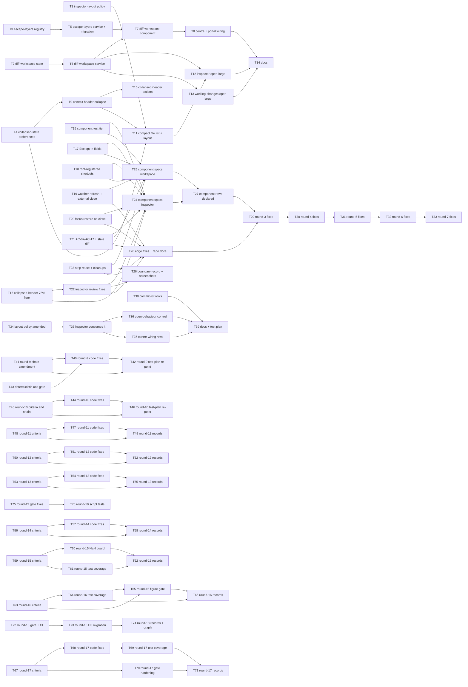

# Epic — inspector-diff-workspace

> **Spec:** [spec.md](../spec.md) · **Design:** [sad.md](../sad.md) · **Screens:** [screens.md](../screens.md) · **ADRs:** [adr/](../adr/) · Data model / API: N/A (no schema or contract change — the only persisted delta is two durable preference keys, see [sad §4 pillar 5](../sad.md)).

## Goal

Make the commit file list the dominant block of the inspector whenever a commit is selected (collapsible commit header, compact file list, list floor of 50 % / 75 % on the right without stacked panels) — the commit diff is read only at centre width, not in the inspector (owner reversal 2026-09-07, [spec §8](../spec.md)) — and let the developer hand any single file's diff the full centre width and come back in one gesture each way from History and Changes — without regressing any existing layout mode ([spec §2](../spec.md)). <!-- scoped 2026-09-09 (owner, review round 14 O1): the summary quoted the two figures with no placement scope, and they are measured with the inspector on the right and no stacked panels (spec §6 rows 1–2). Scoped rather than given the carve-out pointer: this is a one-line goal summary, and the exception it would point at is longer than the fact. The cross-placement guarantee and its carve-out live in the **List floor** invariant of the Risks / Hard rules list below. Cited by anchor rather than by line number since 2026-09-09 (T62, review round 15 R15-S2-F2): this marker said «:206», and the registration rows the same wave inserted had already moved that invariant to :215, so it pointed a reader at a blank line -->

## Scope

- **In:** three framework-free logic modules in `src/app/core/services/` (layout policy, workspace state, Esc layer registry) with Vitest specs; two Angular services over them; two durable preference keys; the new `features/diff-workspace/` component; surgical changes to `commit-inspector`, `working-changes`, `diff-viewer`, `main-content`, and the six existing Esc consumers ([sad §5](../sad.md)).
- **Out:** two side-by-side diffs, document tabs, redesign of the Changes view, changes to diff rendering, toolbar / rail contrast, multi-file continuous diff ([spec §3](../spec.md)); anything on the Rust side (unchanged, [sad §4](../sad.md)).

## Task map

<!-- T63–T66 added to this graph 2026-09-10 (T67, review round 17): the round-16 wave registered
itself in the task table and in `tracker.md` but never reached this graph, so the dependency view
was stale from T62 onward for a whole round. **Diagnosis corrected 2026-09-10 (T74, review round 18
R18-F5): it was stale from T26, not from T62.** T27–T33 — seven ids across five review rounds — had
never been drawn at all, so T67's «both waves are now drawn» was true of the two waves it looked at
and false of the graph. T74 drew the seven and their edges, and moved the completeness check below
out of this comment and into the registration validator, because a check that lives in prose is a
check that gets written and not run — which is exactly what happened to this one. T63's own DoD claimed «`_epic.md` edges and
`tracker.md` Deps agree for T63–T66» — the table agreed and the graph was not written. Round 17's
two reviewers and the lead all verified the table rows against `tasks.json` and `tracker.md` and
none of the three looked at the graph, which is why this survived a CHANGES-REQUESTED review. Both
waves are now drawn, and the check for the next one is «every id in `tasks.json` appears as a
mermaid node», not «the rows agree». -->

Parallel starts: T1 · T2 · T3 · T4. Then T5 ‖ T6 ‖ T9. Then T7 ‖ T10/T11. Then T8 ‖ T12 ‖ T13.

**Reversal wave (2026-09-07, T34–T39):** parallel starts T34 · T38. Then T35 (compile-coupled with T34 through `inspector-layout.ts`). Then T36 ‖ T37. Then T39.

**Round-9 wave (2026-09-08, T40–T43):** strictly serial — T43 makes the gate trustworthy, T41 fixes the criteria, T40 writes the code and the rows against them, T42 maps what landed. T41 and T42 touch only documents; T40 is the only lane that opens `src/`.

**Round-10 wave (2026-09-08, T44–T46):** the same shape, for the same reason — T45 states the criteria (AC-04's empty-list clause, the §6 carve-out, the KPI), T44 writes the code and the rows against them, T46 maps what landed once the loop's honest configuration count exists. T45 and T46 touch only documents; T44 is the only lane that opens `src/`.

**Round-11 wave (2026-09-08, T47–T49):** the same shape a third time — T48 states the criteria (the hard-floor carve-out on the cross-placement share, and the §7 KPI the reversal left unreachable), T47 writes the rows against them, T49 maps what landed. T48 and T49 touch only documents; T47 opens `src/` but **only its spec files and comments** — round 11 found the policy correct across the whole reachable space, so there is no production change to make.

**Round-12 wave (2026-09-08, T50–T52):** the same shape a fourth time, and for a sharper reason. Round 12 found the round-11 carve-out right in its band for the collapsed share and wrong in two ways besides — it named the list's two-row floor as a cause (it causes **0** of the 224 misses; the head-cap guard causes all 224) and it waived the *expanded* guarantee over a remainder of 68…135 px where the policy meets it. So **T50 states the criteria first**, byte-identical at AC-18, §6 row 3 and QG-1, and carries the carve-out to the two artefacts round 11 missed (`test-plan.md:90` is T52's, `ux-flows.md:179` is T50's); **T51 writes the code and comments against them**, adds the collapsed share its own cover at a remainder where the 75 % floor actually binds, and pins the three production constants the whole 110 px anchor rests on; **T52 maps what landed**. T50 and T52 touch only documents and share no file with each other; T51 opens `src/` but again **only its spec files and comments**.

**Round-17 wave (2026-09-10, T67–T71):** the first of these waves that is NOT strictly serial. T67 states the criteria and registers, then two independent lanes run in parallel: `T68 → T69` opens `src/` (both edit `inspector-layout.spec.ts`, so they are one lane and cannot be concurrent), and T70 opens `scripts/` plus the artefacts. T71 maps what landed and takes the whole-wave gate. T67 and T70 share `test-plan.md` and `spec.md`, which is why T70 depends on T67 as much for the lane as for the rule text it points at. The two owner decisions this wave carries (**D3** no live artefact writes a figure derived from the code; **D4** a sweep's scope is the branch, not a list) are the first attempt on this branch to end the recurring class by constraining what artefacts may say rather than by adding another checker — rounds 16 and 17 both found the false figure inside the instrument built to prevent it.
<!-- The «Round-N wave» notes above lapse after round 12: rounds 13, 14, 15 and 16 never got one. Not backfilled here (four rounds of history is not this task's scope) — recorded so the gap is deliberate rather than unnoticed. -->

**Review follow-ups (2026-09-03, T15–T26):** parallel starts T15 · T16 · T17 · T18 · T19/T20/T21 (one compile-coupled lane through `diff-workspace-state.ts` / `diff-workspace.service.ts`) · T23. Then T22. Then T24 ‖ T25. Then T26.

## Tasks

See [tracker.md](./tracker.md) for status. Machine contract: [tasks.json](../tasks.json).

| # | Task | Layer | Blocked by | DoD (short) |
|---|---|---|---|---|
| T1 | [Write the inspector layout policy](./inspector-layout-policy.md) | domain | — | `inspector-layout.spec.ts` asserts row / clamp floors and the sequential yield for the four spec configurations |
| T2 | [Write the diff workspace state machine](./diff-workspace-state.md) | domain | — | `diff-workspace-state.spec.ts` covers open / navigate / setFiles / close, restore instructions, edges, advance-or-close, close-on-selection-change |
| T3 | [Write the Esc layer registry](./escape-layers-registry.md) | domain | — | `escape-layers.spec.ts` asserts topmost-only resolution over every combination of the six ranks and the text-field rule |
| T4 | [Add the two collapsed-state durable preferences](./collapsed-state-preferences.md) | infra | — | `preferences-schema.spec.ts` round-trips `commitHeaderCollapsed` / `commitFileListCollapsed` with defaults and rejects bad values |
| T5 | [Ship the Esc layer service and migrate the six consumers](./escape-layers-service-migration.md) | app | T3 | zero `keydown.escape` handlers left in `src/app`; every consumer registers / unregisters through the service; build green |
| T6 | [Ship the diff workspace service](./diff-workspace-service.md) | app | T2 | service exposes open / navigate / setFiles / close signals, closes on any selection / view / tab change, replays scroll + focus on close; build green |
| T7 | [Build the diff workspace component](./diff-workspace-component.md) | ui | T5, T6 | SCR-02 / SCR-04 strip states render, rank-1 Esc layer + close / next / prev shortcuts registered while open; build green |
| T8 | [Wire the centre view and re-host the diff viewer](./centre-and-portal-wiring.md) | wiring | T7 | workspace renders before the `railView` switch; the live diff viewer moves by DomPortal without reload; inspector diff slot is the only `flex-1` child |
| T9 | [Make the commit header collapsible with a clamped body](./commit-header-collapse.md) | ui | T4 | SCR-01 default / body-expanded / header-collapsed render from the remembered preference; `mod+shift+h` toggles; build green |
| T10 | [Put the six commit actions inline in the collapsed header with overflow into More](./collapsed-header-actions.md) | ui | T9 | SCR-01 header-collapsed + SCR-06: actions that do not fit move into More, Reset keeps its submenu and confirmation |
| T11 | [Make the commit file list compact and apply the layout policy](./compact-file-list-layout.md) | ui | T1, T4, T9 | SCR-01 file-list-overflow / collapsed / empty / squeezed render; `ResizeObserver` → policy → CSS vars; `mod+shift+l` toggles |
| T12 | [Add the open-large gesture to the commit inspector](./inspector-open-large.md) | ui | T6, T11 | double-click / control / `mod+d` open the workspace with the displayed file order and a snapshot; active row follows; workspace-open state renders |
| T13 | [Add the open-large gesture to the working-changes lists](./working-changes-open-large.md) | ui | T6 | staged / unstaged rows open the workspace on one side; lists + composer hidden; commit shortcuts inert; advance-or-close with toasts |
| T14 | [Document the inspector layout, the diff workspace and the Esc layer order](./docs-design-shell.md) | docs | T8, T12, T13 | `DESIGN.md` §App shell / §Density / keyboard notes describe the shipped behaviour; shortcut table lists the six new combos |
| T15 | [Enable the component test tier in the existing unit runner](./component-test-tier.md) | infra | — | a component spec runs under `pnpm test` next to the pure-TS specs; `src/testing/` stubs; testing policy lines amended |
| T16 | [Add the collapsed-header 75 % floor to the layout policy and drop the dead token](./collapsed-header-floor.md) | domain | — | 0.75 floor when collapsed, tabled over 2 / 6 / 30 files; `panelPad` gone |
| T17 | [Scope the Esc text-field rule to fields that opt in](./escape-opt-in-fields.md) | app | — | only `data-escape-clears` fields clear; the composer draft survives Esc; matrix gains the empty-field axis |
| T18 | [Register the six workspace shortcuts from root-alive services](./root-registered-shortcuts.md) | app | — | six SCR-05 rows listed with the workspace closed, in History and Changes |
| T19 | [Refresh the workspace diff on watcher events and close on external emptying](./watcher-refresh-and-external-close.md) | app | — | `runRefresh` reloads the active diff; ownership is a flag; external removal closes, own action advances with `navigated` |
| T20 | [Restore focus on close reliably, including the commit-row branch](./focus-restore-on-close.md) | app | — | scroll-into-view then focus after the list restores its offset; `mod+d` from the commit list keys the sha; dead snapshot field gone |
| T21 | [Reconcile AC-07 with AC-17 and clear the stale diff](./reconcile-ac07-ac17.md) | app | — | emptied commit list clears `diffText`; F4 / US-03 H→I describe the residual case |
| T22 | [Inspector fixes: header measurement, filter republish, double fetch, docs bound](./inspector-review-fixes.md) | ui | T16 | rendered header height; filter removal is `keep`; one fetch per double-click; DESIGN.md bound cell |
| T23 | [Reuse the diff strip, hide the composer once, break the core→shared barrel import](./strip-reuse-and-cleanups.md) | ui | — | shared chip + path piece; one hide mechanism; module-path import; tooltips from `formatCombo` |
| T24 | [Component specs: commit inspector, open-large gesture and shortcuts help](./component-specs-inspector.md) | ui | T15, T16, T17, T18, T20, T21, T22 | the plan's component rows for T9–T12 and the Keyboard page pass |
| T25 | [Component specs: diff workspace, centre wiring and working changes](./component-specs-workspace.md) | ui | T15, T17, T18, T19, T21, T23 | the plan's component rows for T7, T8, T13 pass |
| T26 | [Record the task-boundary widenings and refresh the screenshots](./boundary-record-and-screenshots.md) | docs | T22, T23 | three task files record the extra files; screenshots recaptured or reported blocked |
| T27 | [Component rows the plan declared](./component-rows-declared.md) | ui | T24, T25 | the nine component rows the re-review found unwritten pass; TestBed provides icons; shared fixtures; dead test symbols gone |
| T28 | [Edge fixes and repo docs](./edge-fixes-and-repo-docs.md) | app | T19, T20, T21, T22, T23 | refresh re-checks its source; origin travels with the payload; pending focus key expires; residual AC-07 resets the shown file; header bounded; toggles view-scoped; DESIGN / AGENTS / ARCHITECTURE / UI-kit README match HEAD |
| T29 | [Round-3 fixes](./round3-fixes.md) | app | T27, T28 | the commit list expires only keys it owns, pinned with both lists mounted; `headerMaxH` floored, rounded, tabled and fed into `diffHeight`; the AC-03 row asserts the cap; the AC-09 component row exists; AGENTS.md lists the six stand-ins; no real-time sleeps beyond the debounce |
| T30 | [Round-4 fixes](./round4-fixes.md) | app | T29 | the inspector expires a bare-path key whose row is gone; the commit-row key shape is shared from the state module and the T20 row imports it; the AC-03 host row and the pure table assert the cap's value; the clamp comment; the debounce wait is exact |
| T31 | [Round-5 fixes](./round5-fixes.md) | app | T30 | `focusKeyOwner` pinned on its three arms and `WORKING_SIDES` typed from the union; the host row pins the cap's literal 126 with one injection; the Q2 row has no vacuous assertion; the T30 RED note corrected |
| T32 | [Round-6 fixes](./round6-fixes.md) | app | T31 | the Q2 row's focus assertion — unfailable because nothing on the restore path focuses inside the panel — is gone, its proof left to `pendingFocusKey()` and the returning-path block; `test-plan.md` and the T31 task file describe what landed |
| T33 | [Round-7 fixes](./round7-fixes.md) | app | T32 | the Q2 row keeps no assertion advertised against a mutation it cannot detect — `focusedTheRow` gone, each surviving assertion named with the mutation that reddens it, both mutations run; the T32 task file and `test-plan.md` record that the returning-path block never proved the focus |
| T34 | [Rewrite the layout policy around the commit file list as the protected block](./amended-layout-policy.md) | domain | — | the policy protects the list: no 6-row cap, no `diffHeight`, the clamp yields before the rows, floors unchanged |
| T35 | [Feed the amended policy into the commit inspector and drop the diff-share patch](./amended-inspector-consumption.md) | ui | T34 | no `diffHeight` left in `commit-inspector.ts`; the four stale rows pass against the amended AC-03 / AC-04 / AC-06 |
| T36 | [Cover the open-behaviour control and its durable preference](./open-behaviour-preference.md) | ui | T35 | both click modes, the control's live-mode label, the three gestures in both modes, and the preference round-trip pass (AC-22) |
| T37 | [Rewrite the three centre-wiring rows against the collapsed History diff slot](./centre-wiring-rows-amended.md) | ui | T35 | the zero-height parking slot, the capped header and the file list as the only growing child at the bottom |
| T38 | [Rewrite the two AC-08 restore rows for the click-opens-workspace default](./commit-list-rows-amended.md) | ui | — | both rows pass with the preference pinned, no assertion weakened, the focus mutation verified |
| T39 | [Bring the repo docs and the test plan in line with the reversal](./docs-after-reversal.md) | docs | T36, T37, T38 | `DESIGN.md` has no stale diff-slot rule; AC-22 documented; `test-plan.md` maps AC-22 |
| T40 | [Round-9 code fixes](./round9-code-fixes.md) | domain | T41, T43 | the `panelHeadH` cap floor and the 2-row list floor each redden a row; the workspace chevron gate is covered in both directions; an empty list claims a bare head |
| T41 | [Round-9 chain amendment](./round9-chain-amendment.md) | docs | — | `sad.md` §6, `ux-flows.md` and `screens.md` describe the inspector the reversal left; AC-22 exists in the SAD; AC-05 says «left empty»; §7 stops measuring a diff viewer that is gone |
| T42 | [Round-9 test-plan re-point](./round9-test-plan-repoint.md) | docs | T40, T41 | no test-plan row names a deleted test, `diffHeight` or a literal the suite does not produce |
| T43 | [Deterministic unit gate](./deterministic-unit-gate.md) | infra | — | three consecutive `pnpm test` runs report the same count, all green; the flakiness and what it costs the record are written down |
| T44 | [Round-10 code fixes](./round10-code-fixes.md) | domain | T45 | the fixed flex bases redden a row when made growing; the share sweep asserts every configuration with no escape hatch (168 as T44 left it, 192 after T47); `Math.round` → `Math.floor` and a height outside the class the expanded quotient rounds against |
| T45 | [Round-10 criteria and chain amendment](./round10-criteria-and-chain.md) | docs | — | the empty-list rule is a criterion and a carve-out; the unreachable ≥ 60 % KPI is gone; `sad.md` §10 and the canonical glossary come through the reversal |
| T46 | [Round-10 test-plan re-point](./round10-test-plan-repoint.md) | docs | T44, T45 | the thesis, the §NFR validation bullets and the sweep rows describe the suite that runs |
| T47 | [Round-11 code fixes](./round11-code-fixes.md) | domain | T48 | the collapsed residue class is watched; a class-based grow reddens the AC-19 row; the displayed-row-count wiring and the caller's clamp guard are pinned; the collapsed twin of the 220 / 110 row exists |
| T48 | [Round-11 criteria amendment](./round11-criteria-amendment.md) | docs | — | the cross-placement share carries the hard-floor carve-out; §7's third KPI is gone and `screens.md`'s open question closes with it |
| T49 | [Round-11 records](./round11-records.md) | docs | T47, T48 | the test plan quotes the carve-out and the count T47 leaves; `files_hint` agrees between `tasks.json` and every task file for T40–T49 |
| T50 | [Round-12 criteria amendment](./round12-criteria-amendment.md) | docs | — | the carve-out names only the guard that causes the miss and splits its band per collapse state, byte-identical at three sites; the US-07 flow prose carries it too |
| T51 | [Round-12 code fixes](./round12-code-fixes.md) | domain | T50 | the note states one cause and re-derived figures; the collapsed 75 % floor reddens a row of its own; the stacked bases and `MIN_BOTTOM_PX` are pinned |
| T52 | [Round-12 records](./round12-records.md) | docs | T50, T51 | the AC-18 rows agree with the §NFR bullet and name the tests that pin them; every `acs` entry resolves to a row; T48's third grep bullet and its 27.5 allowance are corrected |
| T53 | [Round-13 criteria amendment](./round13-criteria-amendment.md) | docs | — | every artefact that states the cross-placement guarantee states its exception: the canonical sentence at the two prose carriers, the pointer at the two mermaid labels and the AC-map row |
| T54 | [Round-13 code fixes](./round13-code-fixes.md) | domain | T53 | `:385` names the twin instead of the whole suite, the 126 px figure carries both densities, and the fourth stacked basis is pinned |
| T55 | [Round-13 records](./round13-records.md) | docs | T53, T54 | T52's `acs` sweep states its predicate and its real set; T51's undisclosed gap is marked; the AC-19 row names the fourth value and T54 |
| T56 | [Round-14 criteria amendment](./round14-criteria-amendment.md) | docs | — | the two carriers that phrase the guarantee with *less* state its exception: the canonical sentence at `sad.md`'s §1 QG-1, the pointer at the `List floor` invariant, and the one-line goal summary scoped to the right placement |
| T57 | [Round-14 code fixes](./round14-code-fixes.md) | domain | T56 | the AC-03 comment names `floor` rather than `round`, and the vacuous `fileCount === 0` arm of `listRows` is gone while the operative one in `protectedList` stays covered |
| T58 | [Round-14 records](./round14-records.md) | docs | T56, T57 | T54's unsatisfiable DoD bullet is named, T53's marker adjacency explained, and every AC in T57's `acs` resolves to a row naming T57 |
| T59 | [Round-15 criteria amendment](./round15-criteria-amendment.md) | docs | — | the carve-out states the guard's own closed form instead of two fixture-derived pixel pairs, no criterion carries a figure the app cannot produce, `DESIGN.md` and ADR-0004 state the exception, and the sweep is scoped to every tracked file the branch touches |
| T60 | [Round-15 production fix](./round15-nan-guard.md) | app | T59 | the measured line height is guarded where it is measured, so a body-less commit can no longer write `--inspector-list-rows: NaN` |
| T61 | [Round-15 test coverage](./round15-test-coverage.md) | domain | T59 | the density fixtures come from `computeMetrics`, and the right-placement clamp, the centre-height floor and both stacked panel hosts are pinned |
| T62 | [Round-15 records](./round15-records.md) | docs | T60, T61 | T57's grep bullet says what its command returns, the `:206` citations point at the invariant's anchor, and the retired-`round` enumeration reads four |
| T63 | [Round-16 criteria amendment](./round16-criteria-amendment.md) | docs | — | the carve-out names the predicate its band actually measures, no tester-facing cell quotes a figure the app cannot produce, the sweep counts are the loop's arithmetic, the three shipped densities reach every measurement instruction, and the SAD stops pinning a token to a constant that does not exist |
| T64 | [Round-16 test coverage](./round16-test-coverage.md) | domain | T63 | the clamp term's rounding has a witness derived from the fixture, the retired band is gone from the spec's prose, and the 220 / 110 carve-out row runs in all three densities |
| T65 | [Round-16 figure gate](./round16-figure-gate.md) | infra | T63, T64 | every figure the artefacts still quote is recomputed from the generator and the shipped policy in the gate, and marker coverage is a reported number rather than a claim |
| T66 | [Round-16 records](./round16-records.md) | docs | T64, T65 | no record cites the epic by line number, no marker is nested, and the retired-`round` enumeration names its own scope |
| T67 | [Round-17 criteria amendment](./round17-criteria-amendment.md) | docs | — | the last three two-density measurement instructions name the three shipped densities, the collapsed-share bullet refers to its run set instead of restating a count, and the two rules that end the figure class by construction are written where the next wave reads them |
| T68 | [Round-17 code fixes](./round17-code-fixes.md) | domain | T67 | the head-cap guard's closed form is a sum, not a doubled sum, and the three counts certified against the wrong one are re-measured from the right one |
| T69 | [Round-17 test coverage](./round17-test-coverage.md) | domain | T68 | the collapsed header's own height and the stacked-panels sum the consumer measures each have a witness that reddens when the term is removed |
| T70 | [Round-17 gate hardening](./round17-gate-hardening.md) | infra | T67 | a lost marker fails loudly, the verifier stops modelling the loop it checks, the coverage number counts comparable quantities, and the artefact scope is the branch rather than a list |
| T71 | [Round-17 records](./round17-records.md) | docs | T69, T70 | every count a record states is what its command returns on the tree that record leaves, and no Outcome certifies a form or a coverage it did not measure |
| T72 | [Round-18 gate and CI fixes](./round18-gate-and-ci.md) | infra | — | the figure gate exits 0 in every checkout shape it can meet and names the base rung it used, and D4's scope check fails when the set the sweep iterates is not what the rule declares |
| T73 | [Round-18 D3 migration](./round18-d3-migration.md) | docs | T72 | no live artefact writes a figure derived from the code: every one is a closed form, a pointer to the generated table, a dated quotation, or an exclusion with its reason |
| T74 | [Round-18 records and graph](./round18-records-and-graph.md) | docs | T73 | every id in tasks.json is a node in the epic graph and the check that says so is executed by the validator, and no record states a count its command does not return |

## Risks / Hard rules

- **The carve-out sentence is byte-identical at ten artefact sites and paraphrased at two.**
  The canonical 319-character clause (md5 `2b9b31ab551ed2f7e942a0a24e457cf5`) lives at
  `spec.md` AC-02 / AC-18 / §6 row 3, `sad.md` §1 QG-1 / §6 F2 / §10 QG-1, `ux-flows.md`,
  `screens.md`, and the two `test-plan.md` rows. `DESIGN.md`'s §Density paragraph and its
  block-height table state the same exception as a **deliberate paraphrase**, because the
  clause is longer than the prose around it, and ADR-0004 and this file take the short
  pointer. A sweep that finds twelve statements and ten byte-identical values has found the
  right thing, not drift. <!-- added 2026-09-10 (T63, review round 16 O5) -->

- **Two automated tiers** (test-plan §Levels, owner decision 2026-09-03, enabled by T15): pure-TS modules (T1–T3, T16) stay framework-free in the `node` environment; component specs (T24, T25) opt into the DOM and may import `@angular/core`. Until T15 lands, the pure-TS rule of [sad §2](../sad.md) still holds.
- **`--file-row-h` is pinned** to the CDK `itemSize` and must not be overridden in CSS ([DESIGN.md §Density](../../../DESIGN.md), ADR-0004); heights only from `--panel-head-h`, `--file-row-h`, `--panel-pad`.
- **One diff renderer** (ADR-0003): no second `<app-diff-viewer>` anywhere; the workspace hosts the live element through a portal outlet.
- **Workspace state is never persisted** (ADR-0001, AC-17); `railView` and its persistence are untouched.
- **Esc never appears as a command shortcut** beyond the `diff-workspace.close` help row (ADR-0002); dismissal runs through the registry only.
- **No new staging capability, no destructive one-key shortcut** ([spec §6.1](../spec.md)); staging gated by `diffSource` (AC-14); Reset keeps its confirmation (AC-21).
- **List floor** (amended 2026-09-07, was the diff floor): the commit file list never receives less than 50 % of the inspector expanded and 75 % collapsed (AC-03), and never less at the bottom or with stacked panels than it keeps on the right (AC-18, AC-19), except where the header-cap guard costs the list its ratio (AC-18). The History inspector hosts no diff viewer at all (AC-06); the Changes view keeps its inline one. <!-- pointer added 2026-09-09 (owner, review round 14 R14-S1-F1): the invariant promised the cross-placement share with no exception, which the policy misses at the bottom’s 220 px minimum with both panels stacked and the header collapsed (0.690909 comfortable at 13 px against 0.750; the reachable compact counter-example is 0.741667 at compact / 17 px, column 240 — the 0.727273 this marker first gave came from the unreachable `COMPACT_TOKENS {30, 30}` fixture, review round 15 R15-S1-F2). An invariant bullet takes the pointer, not the 313-character sentence; AC-18 and §10 QG-1 carry the numbers -->
- **Lanes**: T34 → T35 → T36 share `commit-inspector.spec.ts` / `inspector-layout.ts` (T34+T35 compile-coupled — `diffHeight` is removed from the contract, so `commit-inspector.ts` cannot compile between them; one shared gate and commit is allowed); T9 → T10 → T11 → T12 share `features/commit-inspector/*` (serialized); T5 and T13 share `working-changes.html`; T5 and T8 both touch `features/diff-viewer/` (different files — T5 `diff-view.ts`, T8 `diff-viewer.ts`).
