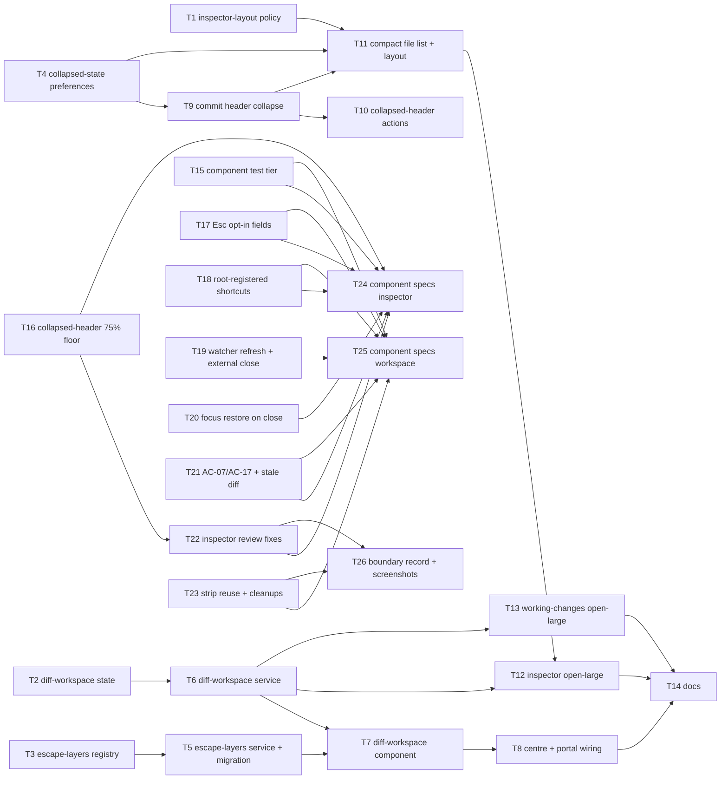

# Epic — inspector-diff-workspace

> **Spec:** [spec.md](../spec.md) · **Design:** [sad.md](../sad.md) · **Screens:** [screens.md](../screens.md) · **ADRs:** [adr/](../adr/) · Data model / API: N/A (no schema or contract change — the only persisted delta is two durable preference keys, see [sad §4 pillar 5](../sad.md)).

## Goal

Make the diff viewer the dominant surface of the inspector whenever a commit is selected (collapsible commit header, compact commit file list, diff floor of 50 % / 75 %), and let the developer hand any single file's diff the full centre width and come back in one gesture each way from History and Changes — without regressing any existing layout mode ([spec §2](../spec.md)).

## Scope

- **In:** three framework-free logic modules in `src/app/core/services/` (layout policy, workspace state, Esc layer registry) with Vitest specs; two Angular services over them; two durable preference keys; the new `features/diff-workspace/` component; surgical changes to `commit-inspector`, `working-changes`, `diff-viewer`, `main-content`, and the six existing Esc consumers ([sad §5](../sad.md)).
- **Out:** two side-by-side diffs, document tabs, redesign of the Changes view, changes to diff rendering, toolbar / rail contrast, multi-file continuous diff ([spec §3](../spec.md)); anything on the Rust side (unchanged, [sad §4](../sad.md)).

## Task map

Parallel starts: T1 · T2 · T3 · T4. Then T5 ‖ T6 ‖ T9. Then T7 ‖ T10/T11. Then T8 ‖ T12 ‖ T13.

**Review follow-ups (2026-09-03, T15–T26):** parallel starts T15 · T16 · T17 · T18 · T19/T20/T21 (one compile-coupled lane through `diff-workspace-state.ts` / `diff-workspace.service.ts`) · T23. Then T22. Then T24 ‖ T25. Then T26.

## Tasks

See [tracker.md](./tracker.md) for status. Machine contract: [tasks.json](../tasks.json).

| # | Task | Layer | Blocked by | DoD (short) |
|---|---|---|---|---|
| T1 | [Write the inspector layout policy](./inspector-layout-policy.md) | domain | — | `inspector-layout.spec.ts` asserts row / clamp floors and the sequential yield for the four spec configurations |
| T2 | [Write the diff workspace state machine](./diff-workspace-state.md) | domain | — | `diff-workspace-state.spec.ts` covers open / navigate / setFiles / close, restore instructions, edges, advance-or-close, close-on-selection-change |
| T3 | [Write the Esc layer registry](./escape-layers-registry.md) | domain | — | `escape-layers.spec.ts` asserts topmost-only resolution over every combination of the six ranks and the text-field rule |
| T4 | [Add the two collapsed-state durable preferences](./collapsed-state-preferences.md) | infra | — | `preferences-schema.spec.ts` round-trips `commitHeaderCollapsed` / `commitFileListCollapsed` with defaults and rejects bad values |
| T5 | [Ship the Esc layer service and migrate the six consumers](./escape-layers-service-migration.md) | app | T3 | zero `keydown.escape` handlers left in `src/app`; every consumer registers / unregisters through the service; build green |
| T6 | [Ship the diff workspace service](./diff-workspace-service.md) | app | T2 | service exposes open / navigate / setFiles / close signals, closes on any selection / view / tab change, replays scroll + focus on close; build green |
| T7 | [Build the diff workspace component](./diff-workspace-component.md) | ui | T5, T6 | SCR-02 / SCR-04 strip states render, rank-1 Esc layer + close / next / prev shortcuts registered while open; build green |
| T8 | [Wire the centre view and re-host the diff viewer](./centre-and-portal-wiring.md) | wiring | T7 | workspace renders before the `railView` switch; the live diff viewer moves by DomPortal without reload; inspector diff slot is the only `flex-1` child |
| T9 | [Make the commit header collapsible with a clamped body](./commit-header-collapse.md) | ui | T4 | SCR-01 default / body-expanded / header-collapsed render from the remembered preference; `mod+shift+h` toggles; build green |
| T10 | [Put the six commit actions inline in the collapsed header with overflow into More](./collapsed-header-actions.md) | ui | T9 | SCR-01 header-collapsed + SCR-06: actions that do not fit move into More, Reset keeps its submenu and confirmation |
| T11 | [Make the commit file list compact and apply the layout policy](./compact-file-list-layout.md) | ui | T1, T4, T9 | SCR-01 file-list-overflow / collapsed / empty / squeezed render; `ResizeObserver` → policy → CSS vars; `mod+shift+l` toggles |
| T12 | [Add the open-large gesture to the commit inspector](./inspector-open-large.md) | ui | T6, T11 | double-click / control / `mod+d` open the workspace with the displayed file order and a snapshot; active row follows; workspace-open state renders |
| T13 | [Add the open-large gesture to the working-changes lists](./working-changes-open-large.md) | ui | T6 | staged / unstaged rows open the workspace on one side; lists + composer hidden; commit shortcuts inert; advance-or-close with toasts |
| T14 | [Document the inspector layout, the diff workspace and the Esc layer order](./docs-design-shell.md) | docs | T8, T12, T13 | `DESIGN.md` §App shell / §Density / keyboard notes describe the shipped behaviour; shortcut table lists the six new combos |
| T15 | [Enable the component test tier in the existing unit runner](./component-test-tier.md) | infra | — | a component spec runs under `pnpm test` next to the pure-TS specs; `src/testing/` stubs; testing policy lines amended |
| T16 | [Add the collapsed-header 75 % floor to the layout policy and drop the dead token](./collapsed-header-floor.md) | domain | — | 0.75 floor when collapsed, tabled over 2 / 6 / 30 files; `panelPad` gone |
| T17 | [Scope the Esc text-field rule to fields that opt in](./escape-opt-in-fields.md) | app | — | only `data-escape-clears` fields clear; the composer draft survives Esc; matrix gains the empty-field axis |
| T18 | [Register the six workspace shortcuts from root-alive services](./root-registered-shortcuts.md) | app | — | six SCR-05 rows listed with the workspace closed, in History and Changes |
| T19 | [Refresh the workspace diff on watcher events and close on external emptying](./watcher-refresh-and-external-close.md) | app | — | `runRefresh` reloads the active diff; ownership is a flag; external removal closes, own action advances with `navigated` |
| T20 | [Restore focus on close reliably, including the commit-row branch](./focus-restore-on-close.md) | app | — | scroll-into-view then focus after the list restores its offset; `mod+d` from the commit list keys the sha; dead snapshot field gone |
| T21 | [Reconcile AC-07 with AC-17 and clear the stale diff](./reconcile-ac07-ac17.md) | app | — | emptied commit list clears `diffText`; F4 / US-03 H→I describe the residual case |
| T22 | [Inspector fixes: header measurement, filter republish, double fetch, docs bound](./inspector-review-fixes.md) | ui | T16 | rendered header height; filter removal is `keep`; one fetch per double-click; DESIGN.md bound cell |
| T23 | [Reuse the diff strip, hide the composer once, break the core→shared barrel import](./strip-reuse-and-cleanups.md) | ui | — | shared chip + path piece; one hide mechanism; module-path import; tooltips from `formatCombo` |
| T24 | [Component specs: commit inspector, open-large gesture and shortcuts help](./component-specs-inspector.md) | ui | T15, T16, T17, T18, T20, T21, T22 | the plan's component rows for T9–T12 and the Keyboard page pass |
| T25 | [Component specs: diff workspace, centre wiring and working changes](./component-specs-workspace.md) | ui | T15, T17, T18, T19, T21, T23 | the plan's component rows for T7, T8, T13 pass |
| T26 | [Record the task-boundary widenings and refresh the screenshots](./boundary-record-and-screenshots.md) | docs | T22, T23 | three task files record the extra files; screenshots recaptured or reported blocked |
| T27 | [Component rows the plan declared](./component-rows-declared.md) | ui | T24, T25 | the nine component rows the re-review found unwritten pass; TestBed provides icons; shared fixtures; dead test symbols gone |
| T28 | [Edge fixes and repo docs](./edge-fixes-and-repo-docs.md) | app | T19, T20, T21, T22, T23 | refresh re-checks its source; origin travels with the payload; pending focus key expires; residual AC-07 resets the shown file; header bounded; toggles view-scoped; DESIGN / AGENTS / ARCHITECTURE / UI-kit README match HEAD |
| T29 | [Round-3 fixes](./round3-fixes.md) | app | T27, T28 | the commit list expires only keys it owns, pinned with both lists mounted; `headerMaxH` floored, rounded, tabled and fed into `diffHeight`; the AC-03 row asserts the cap; the AC-09 component row exists; AGENTS.md lists the six stand-ins; no real-time sleeps beyond the debounce |
| T30 | [Round-4 fixes](./round4-fixes.md) | app | T29 | the inspector expires a bare-path key whose row is gone; the commit-row key shape is shared from the state module and the T20 row imports it; the AC-03 host row and the pure table assert the cap's value; the clamp comment; the debounce wait is exact |
| T31 | [Round-5 fixes](./round5-fixes.md) | app | T30 | `focusKeyOwner` pinned on its three arms and `WORKING_SIDES` typed from the union; the host row pins the cap's literal 126 with one injection; the Q2 row has no vacuous assertion; the T30 RED note corrected |
| T32 | [Round-6 fixes](./round6-fixes.md) | app | T31 | the Q2 row's focus assertion — unfailable because nothing on the restore path focuses inside the panel — is gone, its proof left to `pendingFocusKey()` and the returning-path block; `test-plan.md` and the T31 task file describe what landed |
| T33 | [Round-7 fixes](./round7-fixes.md) | app | T32 | the Q2 row keeps no assertion advertised against a mutation it cannot detect — `focusedTheRow` gone, each surviving assertion named with the mutation that reddens it, both mutations run; the T32 task file and `test-plan.md` record that the returning-path block never proved the focus |

## Risks / Hard rules

- **Two automated tiers** (test-plan §Levels, owner decision 2026-09-03, enabled by T15): pure-TS modules (T1–T3, T16) stay framework-free in the `node` environment; component specs (T24, T25) opt into the DOM and may import `@angular/core`. Until T15 lands, the pure-TS rule of [sad §2](../sad.md) still holds.
- **`--file-row-h` is pinned** to the CDK `itemSize` and must not be overridden in CSS ([DESIGN.md §Density](../../../DESIGN.md), ADR-0004); heights only from `--panel-head-h`, `--file-row-h`, `--panel-pad`.
- **One diff renderer** (ADR-0003): no second `<app-diff-viewer>` anywhere; the workspace hosts the live element through a portal outlet.
- **Workspace state is never persisted** (ADR-0001, AC-17); `railView` and its persistence are untouched.
- **Esc never appears as a command shortcut** beyond the `diff-workspace.close` help row (ADR-0002); dismissal runs through the registry only.
- **No new staging capability, no destructive one-key shortcut** ([spec §6.1](../spec.md)); staging gated by `diffSource` (AC-14); Reset keeps its confirmation (AC-21).
- **Diff floor**: the diff viewer never receives less than 50 % of the inspector (AC-03) and never less than its 1.0.5 height at the bottom or with stacked panels (AC-18, AC-19).
- **Lanes**: T9 → T10 → T11 → T12 share `features/commit-inspector/*` (serialized); T5 and T13 share `working-changes.html`; T5 and T8 both touch `features/diff-viewer/` (different files — T5 `diff-view.ts`, T8 `diff-viewer.ts`).
