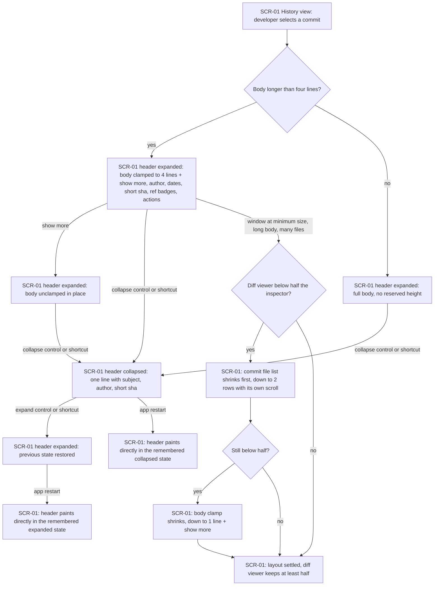
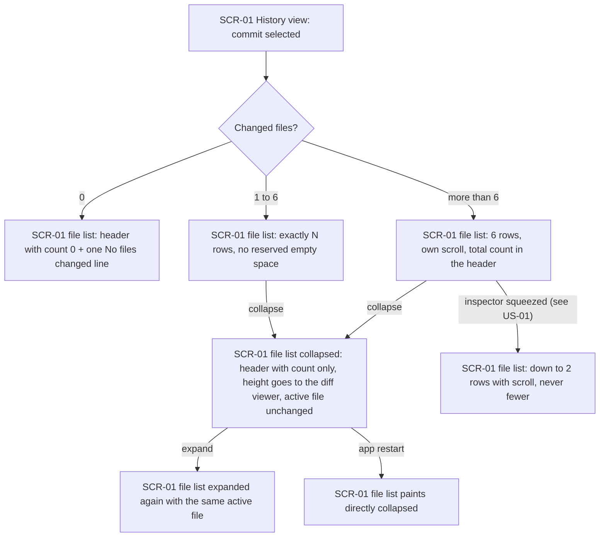
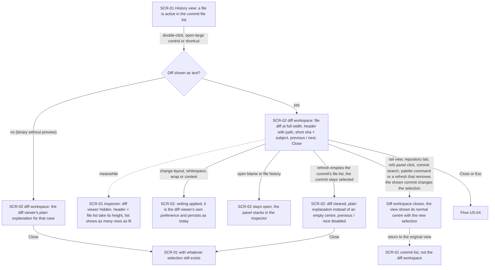
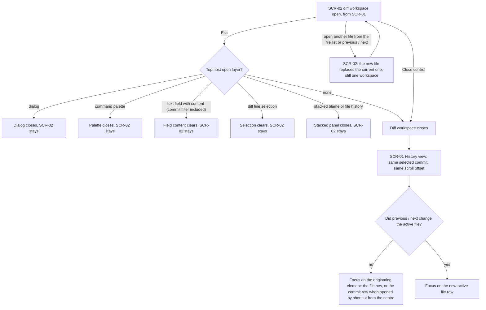
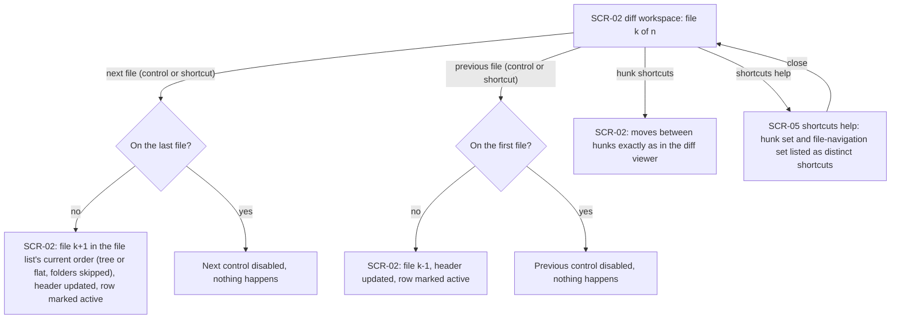
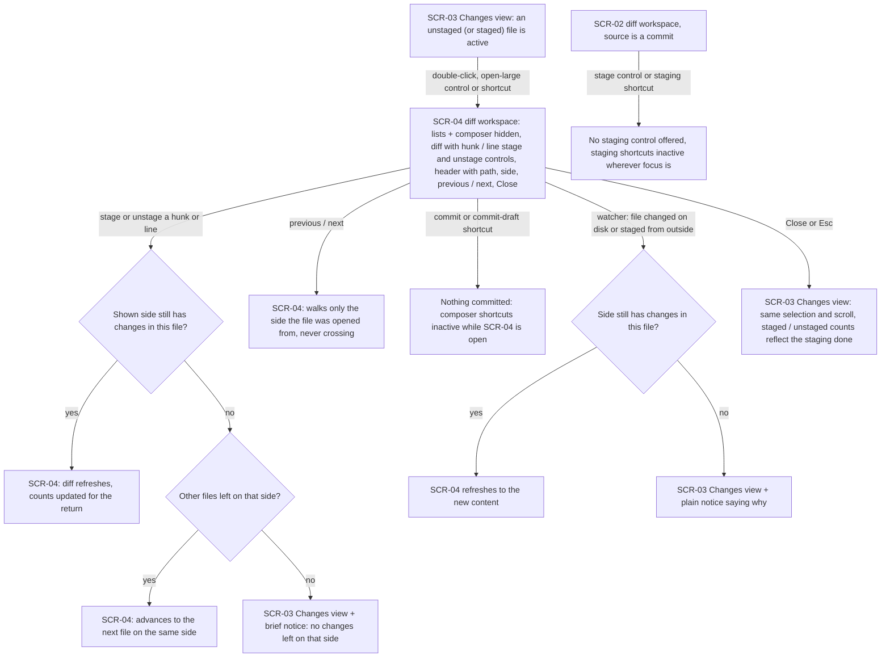
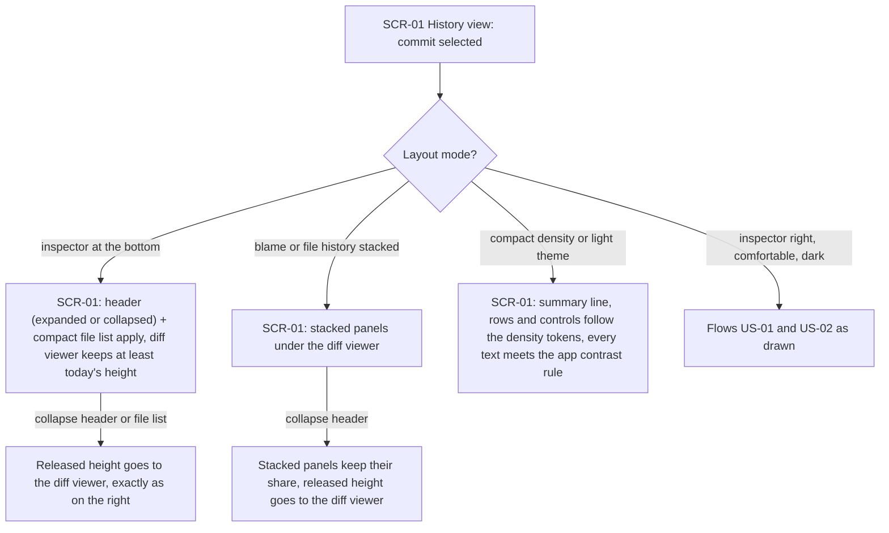
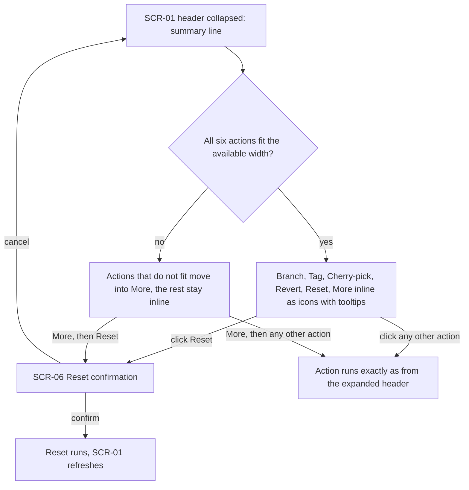

# UX flows — inspector-diff-workspace

> User flows for every UI-touching §4 user story, produced by `ux-flows` (after `clarify`, before
> `design`) and read by `design` (evidence for the target-surface + UI-architecture decisions),
> `sequences` (UI-driven flows align on SCR ids), `screens` (details every inventory row) and
> `plan-tests` (the e2e-through-UI paths). **Always markdown + mermaid `flowchart`**, whatever the
> design tool — this artifact is flow-altitude, not visual design.

> **Glossary:** [feature CONTEXT](./CONTEXT.md) · [project CONTEXT](../../../CONTEXT.md)
> **Derived from:** [spec.md](./spec.md) §4 user stories + §5 acceptance criteria; owner decisions of 2026-09-02 recorded below.

## Platform decisions

- **Posture:** desktop-first — `docs/design-system.md` does not exist, so the posture is deduced from `DESIGN.md` §Layout («desktop productivity app»), the Tauri desktop binary and the minimum window of 960 × 640, and confirmed by the owner on 2026-09-02. Pointer + keyboard only: double-click, shortcuts and Esc are first-class gestures; no touch or narrow-window variants.
- **Navigation shape:** the diff workspace is a *state of the centre view*, not a route, window, tab or overlay (spec §3, feature CONTEXT «Out of scope»). It replaces the centre content in place and Close / Esc restores exactly what it replaced.
- **Modality:** no new dialog. The only dialog these flows visit is Reset's existing confirmation (AC-21). The two notices (AC-13, AC-16) are non-blocking and never take focus.
- **Esc is layered:** one fixed precedence — dialog, then command palette, then text field with content, then diff line selection, then stacked blame / file history, then diff workspace (AC-10). Flow US-04 draws it; the mechanism that enforces the order is a `design` decision, not made here.
- **Where the inspector flows apply:** US-01, US-02, US-07 and US-08 are drawn on the History view (SCR-01) and apply verbatim to every view that shows a selected commit (Reflog); a diff workspace opened from such a view returns to that view's list.
- **Open questions resolved for this stage (spec §8, both due before `ux-flows`):** (1) no sticky «always open diffs in the diff workspace» preference — the gesture per file is the only way in, a single click keeps showing the diff in the inspector; (2) blame and file history launched from inside the diff workspace open stacked in the inspector as today and the diff workspace stays open.
- **Design inputs flagged, not decided:** (a) an owner for keyboard-layer precedence; (b) a snapshot of selection + scroll + focus taken when the diff workspace opens, so Close can restore it (AC-08, NFR ≤ 100 ms); (c) one shared settings source for the diff viewer and the diff workspace (AC-06).
- **Backend-only user stories:** none — all eight §4 stories touch the UI, so all eight have a flow.

## Screen inventory

| ID | Screen | Purpose | Entry | Exit |
|---|---|---|---|---|
| SCR-01 | History view | Commit list in the centre; inspector with the commit header (expanded / collapsed), the compact commit file list, the diff viewer and any stacked blame / file history | Rail «History», app launch, Close / Esc from SCR-02, any selection change while SCR-02 is open | SCR-02 (open gesture on a file), SCR-05, SCR-06, other rail views |
| SCR-02 | Diff workspace · commit | One file of the selected commit at full centre width; header with file path, source commit (short sha + subject), previous / next file, Close; the inspector keeps header + file list and hides its diff viewer | Double-click, open-large control or shortcut on the active file in SCR-01 | SCR-01 (Close, Esc, or any change of the selected commit / rail view / repository tab) |
| SCR-03 | Changes view | Staged and unstaged lists with the commit composer in the centre; inspector diff viewer | Rail «Changes», Close / Esc from SCR-04, a side left with no changes | SCR-04 (open gesture on a staged or unstaged file), other rail views |
| SCR-04 | Diff workspace · working tree | One staged or unstaged file at full centre width with hunk / line stage and unstage controls; header with file path, side, previous / next file (same side only), Close | Double-click, open-large control or shortcut on the active file in SCR-03 | SCR-03 (Close, Esc, side emptied by own or external action, any selection change) |
| SCR-05 | Shortcuts help | The existing shortcuts list, now carrying the diff workspace set (open, close, previous / next file) next to the hunk set | Shortcuts-help shortcut or menu from any view | Back to the view it was opened from |
| SCR-06 | Reset confirmation | The existing confirmation before Reset, unchanged | Reset from the expanded or the collapsed commit header | Back to SCR-01 (confirm runs the reset, cancel does nothing) |

## Flows

### Flow: US-01 — Read the commit message without scrolling, collapse it when reviewing

The developer selects a commit in the History view. If the message body is longer than four lines the header opens expanded with the body clamped to four lines plus a «show more» control; a shorter body shows in full without reserving height. Either way author, dates, short sha, ref badges and the six actions are visible and the diff viewer keeps at least half the inspector. «Show more» unclamps the body in place. The collapse control or its shortcut turns the header into one summary line (subject, author, short sha) and the diff viewer takes at least three quarters; the expand control restores the previous state. When the window is at its minimum size with a long body and many files, the commit file list shrinks first (down to two rows with its own scroll), then the body clamp shrinks (down to one line plus «show more»), and the diff viewer never goes below half. The collapsed or expanded state is remembered and, on restart, the header paints directly in that state with no layout shift.

### Flow: US-02 — Keep the commit file list compact

When a commit is selected, the commit file list sizes itself to the real file count: zero files show only the list header with count 0 and a single «No files changed» line; one to six files take exactly that many rows with no empty space; more than six files show six rows (the row height follows the density token) with the list's own scroll and the total count in the header. Collapsing the list leaves only its header with the count, hands the released height to the diff viewer and keeps the active file in the diff viewer; expanding brings the rows back with the same active file. The collapsed state is remembered across restarts and paints directly. When the inspector is squeezed (the US-01 minimum-size branch) the list shrinks down to two rows with scroll and never fewer.

### Flow: US-03 — Open a file in the diff workspace

With a file active in the commit file list, a double-click, the open-large control or the open-large shortcut turns the centre view into the diff workspace showing that file's diff at full width. Its header carries the file path, the source commit (short sha and subject), previous / next file controls and Close, and its layout, whitespace, wrap and context settings are the diff viewer's own preferences (changing one here changes the diff viewer and persists). Meanwhile the inspector hides its diff viewer and the commit header plus the file list take that height. If the file cannot be shown as text (a binary without preview) the workspace shows the diff viewer's plain explanation instead of an empty centre. Blame or file history launched from here stack in the inspector while the workspace stays. If a refresh leaves the commit selected but empties its file list, the diff is cleared so the same plain explanation replaces it with previous / next disabled, and Close returns to the History view with whatever selection still exists. Any change of selection (rail view, repository tab, refs panel click, commit search, palette command, or a refresh that removes the shown commit) closes the workspace, the view shows its normal centre with the new selection, and coming back to the original view shows its commit list. Close or Esc is the US-04 flow.

### Flow: US-04 — Return from the diff workspace

With the diff workspace open, Esc first asks which layer is topmost: an open dialog closes, else the command palette closes, else a text field with content (the commit filter included) clears, else a diff line selection clears, else a stacked blame or file-history panel closes, and each of those leaves the workspace open. Only when none of the five is open does Esc close the workspace; the Close control closes it directly. Closing brings the History view back with the same selected commit and the same scroll offset. Keyboard focus returns to the element that had it when the workspace opened (the file row in the commit file list, or the commit row when opened by shortcut from the centre), unless previous / next changed the active file, in which case focus lands on the now-active file row. Opening another file while the workspace is open, from the file list or with previous / next, replaces the content: there is never more than one workspace.

### Flow: US-05 — Step through files inside the diff workspace

Inside the diff workspace on file k of n, «next file» (control or shortcut) shows file k+1 in the order the commit file list currently displays (tree or flat, folders skipped), updates the workspace header and marks that row active in the list; on the last file the next control is disabled and nothing happens. «Previous file» mirrors it, disabled on the first file. The existing hunk shortcuts keep moving between hunks exactly as in the diff viewer; file navigation uses distinct shortcuts, and opening the shortcuts help lists both sets side by side before returning to the workspace.

### Flow: US-06 — Review working-tree changes in the diff workspace

In the Changes view, opening the active staged or unstaged file with the same gesture hides the staged and unstaged lists and the commit composer and shows the diff at full width with hunk and line stage / unstage controls; the header names the path and the side. Staging or unstaging there refreshes the diff and the counts the developer will see on return; when the action leaves the shown side with no changes in that file, the workspace advances to the next file on the same side, or closes with a brief notice when none remains. Previous / next walk only the side the file was opened from and never cross to the other side. The commit and commit-draft shortcuts do nothing while the workspace is open. When the watcher reports the file changed on disk or was staged from outside, the workspace refreshes; if that leaves the side with no changes, it closes and the Changes view returns with a plain notice saying why. Close or Esc returns to the Changes view with the same selection and scroll and with the counts reflecting the staging done. In the commit-sourced workspace (SCR-02) no staging control is offered and the staging shortcuts stay inactive wherever focus is.

### Flow: US-07 — Keep existing layout modes

The redesigned inspector behaves the same in every existing layout mode. With the inspector at the bottom, the commit header (expanded or collapsed) and the compact file list apply and the diff viewer keeps at least the height it has today; collapsing the header or the list hands the released height to the diff viewer exactly as on the right. With blame or file history stacked under the diff viewer, collapsing the header leaves the stacked panels their share and gives the released height to the diff viewer. In compact density or the light theme, the summary line, rows and controls follow the density tokens and every text meets the app's contrast rule. The default placement (right, comfortable, dark) is the US-01 and US-02 flows as drawn.

### Flow: US-08 — Reach commit actions from the collapsed header

With the header collapsed, the summary line carries the same six actions as the expanded header (Branch, Tag, Cherry-pick, Revert, Reset, More) inline as icons with tooltips, one click each. When they do not all fit the available width, the ones that do not fit move into More and the rest stay inline. Reset keeps its confirmation: clicking it (inline or from More) opens the Reset confirmation, confirm runs the reset and refreshes the History view, cancel returns to the collapsed header. Every other action runs exactly as it does from the expanded header.

## AC coverage

| AC | Shown by | Notes |
|---|---|---|
| AC-01 | Flow US-01 → B → C / D | Clamp to 4 lines + show more, or full short body with no reserved height; diff ≥ half |
| AC-02 | Flow US-01 → F, F → G, F → M, G → N | Collapse to the summary line, expand restores, state remembered across restart |
| AC-03 | Flow US-01 → H → I → J → K → L | File list shrinks first (floor 2 rows), then the clamp (floor 1 line); diff never below half |
| AC-04 | Flow US-02 → B → C / D / E | 0 files, 1–6 exact rows, > 6 → six rows + scroll + count |
| AC-05 | Flow US-02 → F, H | Collapsed list keeps count, height to the diff, active file unchanged, remembered |
| AC-06 | Flow US-03 → A → C, E, F | Three open gestures, workspace header contents, shared settings, inspector diff viewer hidden meanwhile |
| AC-07 | Flow US-03 → D, H → I | Binary without preview; the commit stays selected with an emptied file list; Close still returns (a removed commit moves the selection and follows AC-17 → J) |
| AC-08 | Flow US-04 → H → I → J → K / L | Same commit + scroll, focus to the originating row or the now-active file row |
| AC-09 | Flow US-04 → M | Another file replaces the current one, one workspace at most |
| AC-10 | Flow US-04 → B branches C–H | Fixed Esc precedence over the six layers |
| AC-11 | Flow US-05 → B → C / D, E → F / G | Order of the file list, folders skipped, disabled at the ends |
| AC-12 | Flow US-05 → H, I | Hunk shortcuts unchanged, distinct file shortcuts, both in SCR-05 |
| AC-13 | Flow US-06 → B, C → D / E → F / G, H | Lists + composer hidden, staging controls, advance on empty side, same-side navigation |
| AC-14 | Flow US-06 → N → O | Commit-sourced workspace offers no staging and its shortcuts are inactive |
| AC-15 | Flow US-06 → I | Commit / commit-draft shortcuts inert while SCR-04 is open |
| AC-16 | Flow US-06 → J → K / L | Watcher refresh; external emptying closes with a notice |
| AC-17 | Flow US-03 → J → K | Any selection change closes the workspace; the original view returns to its list |
| AC-18 | Flow US-07 → C → D | Inspector at the bottom |
| AC-19 | Flow US-07 → E → F | Stacked blame / file history keep their share |
| AC-20 | Flow US-07 → G | Compact density and light theme |
| AC-21 | Flow US-08 → B → C / D, E → F / A, G | Six inline actions, overflow into More, Reset confirmation kept |
